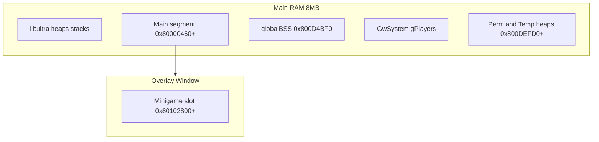

# Memory Map

> **Runtime RDRAM / KSEG0:** For physical memory regions, TLB, and overlay VRAM anchors, see [hardware/02-memory-map.md](hardware/02-memory-map.md).

## ROM Layout (32 MB)

| Region | ROM Range | Size | Description |
|--------|-----------|------|-------------|
| Header | `0x000000`–`0x00003F` | 64 B | N64 cart header |
| IPL boot | `0x000040`–`0x000FFF` | ~4 KB | Initial boot code |
| Entry | `0x001000`–`0x00105F` | 96 B | Program entrypoint |
| **Main** | `0x001060`–`0x0D57EF` | ~856 KB | Permanent engine code/data |
| Main BSS | `0x0D57F0` (VRAM `0x800D4BF0`) | `0x2DC10` | Global runtime BSS |
| **Overlays** | `0x0D57F0`–`0x418A4F` | ~4.1 MB | 115 swappable modules |
| **Assets** | `0x418A50`–`0x1FFFFFF` | ~27 MB | MainFS, models, audio, boards |

Overlay boundaries are stored in a **36-byte table** at ROM **`0xC9474`** (VRAM `0x800CAD90`).

## RAM Regions

## Overlay Table Entry (36 bytes)

| Offset | Field | Notes |
|--------|-------|-------|
| `0x00` | `romStart` | Module start in ROM |
| `0x04` | `romEnd` | Next module start / end |
| `0x08` | `vramText` | Always `0x80102800` for game overlays |
| `0x0C` | `vramData` | Load address for data |
| `0x10` | `vramEnd` | BSS high watermark |

Discovered programmatically by `tools/scan_overlays.py` — **116 table rows**, **115 game overlays** (`0x00`–`0x72`).

## PI DMA Pattern

Overlays are copied from ROM into the minigame RAM slot before `omOvlCallEx` transfers control. Each overlay reuses **`exclusive_ram_id: minigame`** in splat config so only one module occupies the window at a time.
