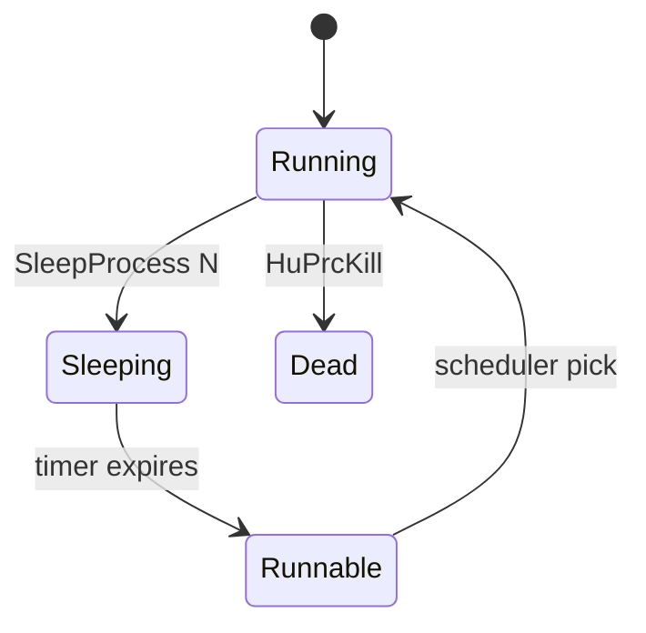

# Process System (HuPrc)

Mario Party 2 uses a **cooperative process scheduler** (Hudson `HuPrc` API) built on **`setjmp`/`longjmp`** context switches rather than preemptive OS threads for gameplay logic.

> **Hardware note:** HuPrc processes are **not** VR4300 hardware threads. libultra OS threads (VI/PI/SI managers) use real exception-based preemption on the same CPU. See [hardware/15-cpu-software-stack-overview.md](hardware/15-cpu-software-stack-overview.md), [hardware/16-libultra-os-threads-messaging.md](hardware/16-libultra-os-threads-messaging.md), [hardware/18-mp2-cpu-engine-scheduling.md](hardware/18-mp2-cpu-engine-scheduling.md), and [hardware/01-vr4300-cpu.md](hardware/01-vr4300-cpu.md).
>
> **Integration deep-dive:** [hardware/34-main-thread-frame-loop.md](hardware/34-main-thread-frame-loop.md)

## Core Struct: `Process`

See [`include/process.h`](../include/process.h) — 0x90 bytes per process.

Key fields:

| Offset | Field | Role |
|--------|-------|------|
| `0x1C` | `exec_mode` | Running / waiting / dead |
| `0x20` | `priority` | Scheduler ordering |
| `0x24` | `sleep_time` | Frames remaining when sleeping |
| `0x2C` | `prc_jump` | Saved registers for resume |
| `0x8C` | `user_data` | Owner object or overlay state |

## Key Functions

| Function | VRAM | Purpose |
|----------|------|---------|
| `InitProcess` | `0x80076E64` | Allocate process slot, spawn idle loop |
| `SleepProcess` | `0x8007D9E0` | Yield for N frames |
| `SleepVProcess` | `0x8007DA44` | Yield until next vertical retrace |
| `HuPrcCreate` | — | Spawn new process with stack |
| `HuPrcSleep` | — | Alias used in decomp symbols |

## Scheduler Flow

`InitProcess` (disassembly label at `0x80076E64`) indexes a fixed-capacity process table at `D_800CD42C` with active count `D_800CD426`.

## Parent / Child Processes

Child minigame processes are linked via `youngest_child` / `oldest_child` pointers. Overlay teardown calls `HuPrcKill` on child trees before unloading code.

## Matched Source

Heap wrappers in [`src/41980.c`](../src/41980.c). Process core remains assembly — see `InitProcess` in [`asm/1060.s`](../asm/1060.s) line ~133617.
