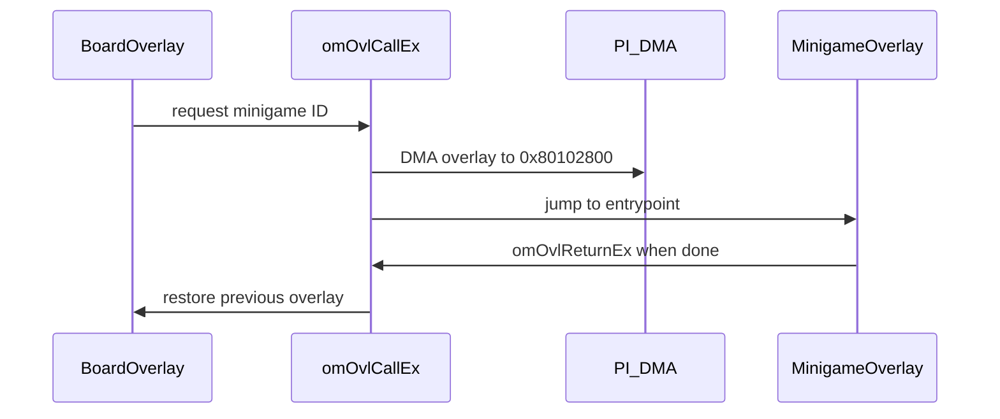

# Object Manager and Overlay Loader

The **`om`** (object manager) subsystem tracks runtime objects and orchestrates **overlay loading** — swapping 115 ROM modules through the shared VRAM window.

## Core APIs

| Function | VRAM | Role |
|----------|------|------|
| `InitObjSys` | `0x800760C0` | Create object pool |
| `omAddObj` | — | Spawn object with update func |
| `omOvlCallEx` | — | Load overlay + run entry |
| `omOvlGotoEx` | — | Transition with history push |
| `omOvlReturnEx` | — | Pop overlay history |
| `omOvlKill` | — | Unload current overlay |

Stub declarations: [`src/engine/om.c`](../src/engine/om.c).

## Overlay History

```c
typedef struct omOvlHisData {
    s32 overlayID;
    s16 event;
    u16 stat;
} omOvlHisData;
```

Stack depth: **12** entries (`omovlhis[12]`, index `omovlhisidx`).

## Overlay Dispatch Table

ROM **`0xC9474`** → VRAM **`0x800CAD90`**. Each entry:

- `romStart` / `romEnd` — PI DMA source range
- `vramText` — execution address (`0x80102800`)
- `vramEnd` — BSS limit for module

Generated catalog: [12-overlay-catalog.md](12-overlay-catalog.md).

## Transition Sequence



## `exclusive_ram_id: minigame`

All gameplay overlays in `marioparty2.yaml` share the **`minigame`** RAM ID so splat/linker enforce a single load slot.

## Board vs Minigame Overlays

| Range | Examples | Role |
|-------|----------|------|
| `0x5E`–`0x61` | BoardSelect, BoardMain, BoardEvents, BoardShop | Board play |
| `0x00`–`0x4D` | Minigame modules | Post-turn games |
| `0x62`–`0x70` | Title, menus, results | Meta flow |
