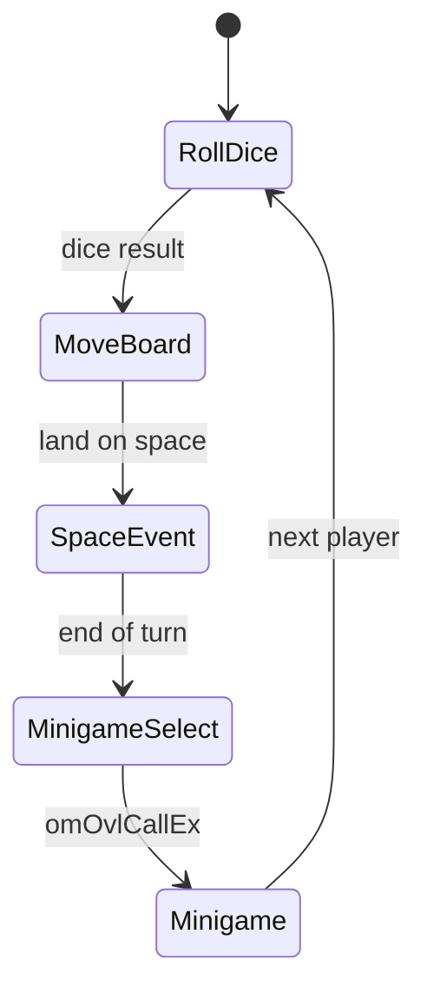

# Game State (`GW_SYSTEM` / `GW_PLAYER`)

Global gameplay state lives in the **main segment BSS** and persists across overlay transitions within a party session.

## `GW_SYSTEM` — `GwSystem` @ `0x800F93A8`

| Offset | Field | Description |
|--------|-------|-------------|
| `0x02` | `current_board_index` | 0–5 board ID |
| `0x04` | `current_game_length` | Lite / Standard / Full / Custom |
| `0x06` | `total_turns` | Turn limit |
| `0x08` | `current_turn` | Current turn number |
| `0x0C` | `star_spawn_indices[7]` | Star location RNG results |
| `0x1E` | `current_player_index` | Active player 0–3 |
| `0x20` | `chosenMinigameIndex` | Selected minigame for round |
| `0x22` | `curPlayerAbsSpaceIndex` | Absolute board space index |

Header: [`include/common_structs.h`](../include/common_structs.h).

## `GW_PLAYER` — `gPlayers[4]` @ `0x800FD2C0`

Stride **0x34** bytes per player.

| Offset | Field | Notes |
|--------|-------|-------|
| `0x01` | `cpu_difficulty` | AI level |
| `0x04` | `character` | Mario, Luigi, etc. |
| `0x08` | `coins` | Current coins (0–999) |
| `0x0E` | `stars` | Star count |
| `0x10`–`0x16` | chain/space indices | Board position |
| `0x19` | `item` | Held item ID |
| `0x2C`–`0x33` | space counters | Happening, red, blue, … |

## Turn State Machine

## Helper Functions

| Function | Purpose |
|----------|---------|
| `GetCurrentPlayerIndex` | Active player |
| `GetPlayerStruct` | Pointer to `GW_PLAYER` |
| `AdjustPlayerCoins` | Add/subtract with clamp |
| `PlayerIsCPU` | Human vs AI test |

## Save Integration

Subset of `GW_PLAYER` and `GW_SYSTEM` fields serialize to EEPROM — see [10-input-and-save.md](10-input-and-save.md) and [hardware/22-mp2-input-save-engine.md](hardware/22-mp2-input-save-engine.md).
