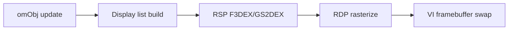

# Rendering

Mario Party 2 renders with **F3DEX microcode** (GBI 2) plus **GS2DEX** for 2D sprites and backgrounds.

> **Hardware deep-dive (graphics sub-series):**
> - [hardware/07-graphics-pipeline-overview.md](hardware/07-graphics-pipeline-overview.md) — Full pipeline and MP2 frame timeline
> - [hardware/08-gbi-rsp-microcode.md](hardware/08-gbi-rsp-microcode.md) — GBI 2, F3DEX2/GS2DEX2, OSTask
> - [hardware/09-rdp-framebuffers-pixel-formats.md](hardware/09-rdp-framebuffers-pixel-formats.md) — TMEM, combiner, blender
> - [hardware/10-vi-display-modes.md](hardware/10-vi-display-modes.md) — OSViMode, display modes
> - Summaries: [hardware/04-rcp-rsp-rdp.md](hardware/04-rcp-rsp-rdp.md), [hardware/05-video-and-audio-io.md](hardware/05-video-and-audio-io.md)

## Pipeline Overview

## Key Functions

| Function | Role |
|----------|------|
| `ScissorSet` | Clip rectangle |
| `ViewportSet` | Camera viewport |
| `func_80018E30` | Matrix / camera setup |
| `func_80050A30` | RCP task submission |

## Fade System

| Function | Role |
|----------|------|
| `InitFadeIn` | Screen fade from black |
| `InitFadeOut` | Fade to black |

Used heavily during overlay transitions.

## 2D Board Backgrounds

Board backgrounds use **HVQ-compressed tiles** in MainFS. Animated tiles swap via the **animation filesystem** (compression type 3 tiles, 0x1800 bytes decompressed).

## Character Models

Player pieces are 3D models driven by board/minigame overlays. `SetBoardPlayerAnimation` selects animation index per player.

## Display Lists

Assembly `.data` sections in overlays contain `gsSP*` commands. splat marks these as `.data` rodata in full yaml configs; current asm-only split embeds them in `.s` files.

## Known Microcodes

Build defines `-DF3DEX_GBI_2`. Standard Nintendo RSP tasks (`osSpTaskLoad`, `osSpTaskStartGo`) in main segment.
