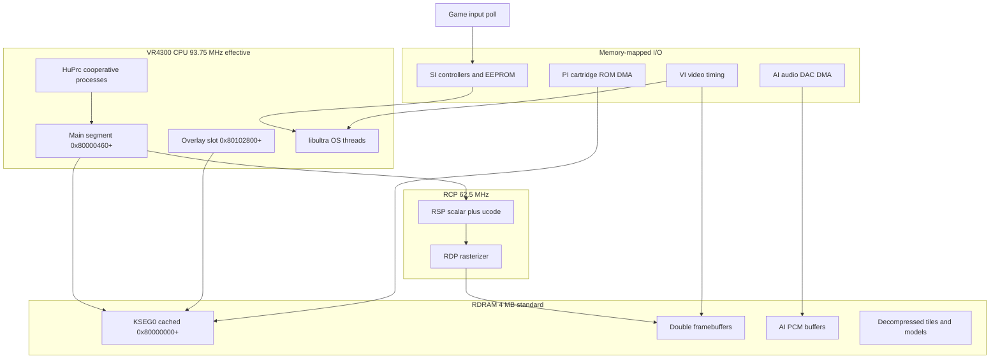
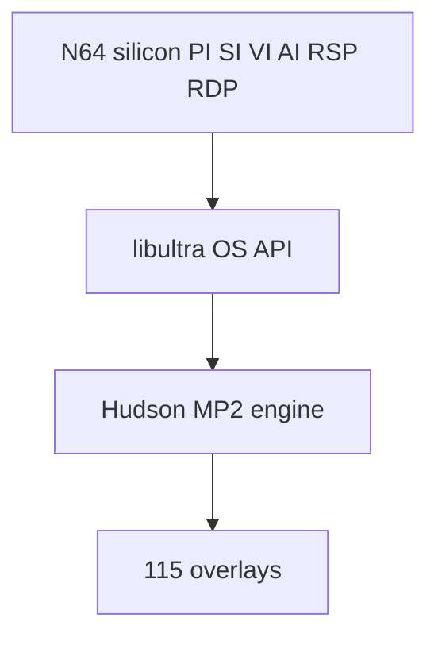

# N64 System Architecture

How Mario Party 2 maps onto real Nintendo 64 hardware — one console, one CPU, shared RAM, and several I/O blocks that the game drives through libultra.

## The Big Picture

The N64 is **not** a PC-style machine with separate GPU RAM. The VR4300 CPU and the Reality Coprocessor (RCP) both access the same **RDRAM** pool. MP2 keeps a permanent **main segment** in low RDRAM and **swaps overlay modules** into a fixed high slot via cartridge DMA.

## Clock Domains

| Component | Clock | Role in MP2 |
|-----------|-------|-------------|
| VR4300 CPU | ~93.75 MHz (÷1.5 from 62.5 MHz bus) | Game logic, decompression, display-list build |
| RCP (RSP + RDP) | 62.5 MHz | F3DEX/GS2DEX microcode, pixel fill |
| PI / SI / VI / AI | Bus-paced | ROM DMA, pads, display, sound |

MP2 is **CPU-bound** during board logic and asset decompression, and **RCP-bound** during 3D board scenes and minigames with heavy geometry.

## Unified Memory Model

| Consumer | What it reads/writes in RDRAM |
|----------|----------------------------|
| VR4300 | Code, stacks, `GwSystem`, heaps, decompressed HVQ tiles |
| RSP | Display lists, vertex buffers, microcode IMEM/DMEM copies |
| RDP | Textures, color buffers, Z-buffer |
| PI DMA | Writes overlay code/data from cart ROM into RDRAM |
| AI DMA | Reads PCM sample buffers for DAC output |

Because the CPU writes display lists and the RSP reads them, MP2 frequently calls **`osWritebackDCacheAll`** before starting RSP tasks so cached CPU writes become visible to the RCP.

## MP2 Software Layers on Hardware

| Layer | Examples | Hardware touched |
|-------|----------|------------------|
| libultra | `osEPiStartDma`, `osViSwapBuffer`, `osContGetReadData` | All I/O |
| MP2 engine | `omOvlCallEx`, `InitProcess`, `ReadMainFS` | PI, scheduling |
| Overlay | Minigame/board code @ `0x80102800` | RSP/RDP per frame |

## One Frame (Typical Gameplay)

1. **VI retrace interrupt** fires (~60 Hz NTSC). libultra VI manager posts a message.
2. **libultra threads** wake; controller manager completes SI read started earlier.
3. **HuPrc processes** run (`SleepVProcess` aligns many loops to retrace).
4. **Game logic** updates `GwSystem`, objects, animation state.
5. **CPU builds** display lists in RDRAM; **`osWritebackDCacheAll`**.
6. **RSP task** submitted: `osSpTaskStartGo` runs F3DEX/GS2DEX ucode.
7. **RDP** fills the back framebuffer.
8. **`osViSwapBuffer`** shows the completed buffer on next retrace.
9. **AI** continues streaming PCM from buffers filled by the audio driver.

## Where MP2 Spends ROM vs RAM

| Storage | Size | Content |
|---------|------|---------|
| Cartridge ROM | 32 MB | Main code, 115 overlays, compressed assets |
| RDRAM main segment | ~856 KB code + 184 KB BSS | Permanent engine |
| RDRAM overlay slot | ~1–2 MB window @ `0x80102800` | One active minigame/board module |
| RDRAM heaps | Variable | Temp/permanent allocations |

See [02-memory-map.md](02-memory-map.md) for virtual addresses and [03-boot-and-cartridge.md](03-boot-and-cartridge.md) for how ROM reaches RAM.

## Hardware Doc Index

| Doc | Topic |
|-----|-------|
| [01-vr4300-cpu.md](01-vr4300-cpu.md) | MIPS CPU, caches, TLB, delay slots |
| [02-memory-map.md](02-memory-map.md) | KSEG0/KSEG1, RDRAM layout, overlay window |
| [03-boot-and-cartridge.md](03-boot-and-cartridge.md) | PIF, IPL, PI DMA, overlay loading |
| [04-rcp-rsp-rdp.md](04-rcp-rsp-rdp.md) | Graphics coprocessor pipeline (summary) |
| [05-video-and-audio-io.md](05-video-and-audio-io.md) | VI and AI (summary) |
| [06-serial-save-interrupts.md](06-serial-save-interrupts.md) | SI, EEPROM, interrupts |
| [07-graphics-pipeline-overview.md](07-graphics-pipeline-overview.md) | Full graphics pipeline, frame timeline |
| [08-gbi-rsp-microcode.md](08-gbi-rsp-microcode.md) | GBI commands, RSP microcode |
| [09-rdp-framebuffers-pixel-formats.md](09-rdp-framebuffers-pixel-formats.md) | RDP, TMEM, pixel formats |
| [10-vi-display-modes.md](10-vi-display-modes.md) | OSViMode, NTSC/PAL, display modes |
| [11-audio-pipeline-overview.md](11-audio-pipeline-overview.md) | Full audio pipeline |
| [12-ai-hardware-and-aspMain.md](12-ai-hardware-and-aspMain.md) | AI DMA, aspMain RSP ucode |
| [13-libaudio-library.md](13-libaudio-library.md) | libaudio alSyn/alSeqp/alSndp |
| [14-mp2-audio-engine-and-assets.md](14-mp2-audio-engine-and-assets.md) | MP2 PlaySound, music, ROM banks |
| [15-cpu-software-stack-overview.md](15-cpu-software-stack-overview.md) | CPU vs RCP, software layers, frame loop |
| [16-libultra-os-threads-messaging.md](16-libultra-os-threads-messaging.md) | OS threads, mesg queues, timers |
| [17-memory-heaps-dma-coherency.md](17-memory-heaps-dma-coherency.md) | Heaps, PI DMA, cache coherency |
| [18-mp2-cpu-engine-scheduling.md](18-mp2-cpu-engine-scheduling.md) | HuPrc, om overlays, main loop |
| [call-inventory.md](call-inventory.md) | libultra call counts in main segment |
| [audio-call-inventory.md](audio-call-inventory.md) | libaudio call counts (auto-generated) |
| [cpu-call-inventory.md](cpu-call-inventory.md) | OS and engine CPU call counts (auto-generated) |
