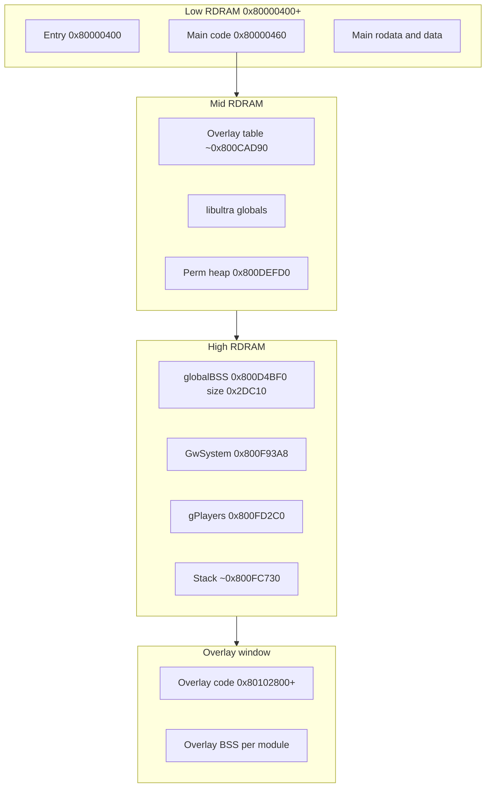

# N64 Memory Map (Runtime)

How physical RDRAM is **seen** by the VR4300 at runtime. This complements [../01-memory-map.md](../01-memory-map.md), which documents the **ROM file** layout inside the 32 MB `.z64`.

## Virtual Address Regions

| Virtual range | Segment | Cached? | Typical contents |
|---------------|---------|---------|------------------|
| `0x00000000`–`0x3FFFFFFF` | KUSEG | Per-T LB | User (rare on N64) |
| `0x40000000`–`0x7FFFFFFF` | KSEG0 alias | Yes | RSP DMEM/IMEM window |
| `0x80000000`–`0x803FFFFF` | **KSEG0** | Yes | **Most MP2 code and data** |
| `0xA0000000`–`0xBFFFFFFF` | **KSEG1** | No | I/O registers, uncached RDRAM |
| `0xC0000000`–`0xFFFFFFFF` | KSEG2 | — | Kernel (unused by games) |

MP2 addresses in disassembly almost always start with **`0x80…`** — that is KSEG0 cached RDRAM.

## MP2 RDRAM Layout (Key Anchors)

| Symbol / region | VRAM | Size / notes |
|-----------------|------|--------------|
| Entry | `0x80000400` | 96 B — [`asm/entrypoint.s`](../../asm/entrypoint.s) |
| Main code start | `0x80000460` | Permanent engine |
| `globalBSS` | `0x800D4BF0` | `0x2DC10` bytes — zeroed at boot |
| Overlay dispatch table | `0x800CAD90` | 36 B × 116 entries; ROM mirror at `0xC9474` |
| `permHeapPtr` | `0x800DEFD0` | Permanent heap root |
| `GwSystem` | `0x800F93A8` | Party/board session state |
| `gPlayers[4]` | `0x800FD2C0` | Stride `0x34` per player |
| Stack pointer | `0x800FC730` | Set in entrypoint delay slot |
| **Overlay load address** | **`0x80102800`** | All 115 overlays ([`marioparty2.yaml`](../../marioparty2.yaml)) |

## Overlay Window

Overlays are **not** mapped at different virtual addresses per minigame. The engine always DMAs code to **`0x80102800`** and branches there. Only one overlay occupies this window at a time (`exclusive_ram_id: minigame` in splat).

Each overlay table entry (36 bytes at ROM `0xC9474`) includes:

| Field | Meaning |
|-------|---------|
| `romStart` / `romEnd` | PI DMA source range in cartridge |
| `vramText` | Execution address (`0x80102800`) |
| `vramData` / `vramEnd` | Data/BSS limits in RDRAM |

When switching minigames, new code **overwrites** the previous overlay in the same RAM window.

## Cartridge ROM Mapping

The 32 MB MP2 ROM is accessed through the **PI** (peripheral interface). CPU or PI DMA can read cart ROM into RDRAM. While mapped, ROM may appear around **`0x10000000`** depending on TLB setup; production code uses **`osEPiStartDma`** rather than direct pointer reads for bulk transfers.

| ROM region | Purpose |
|------------|---------|
| `0x000000`–`0x0D57EF` | Main segment |
| `0x0D57F0`–`0x418A4F` | Overlay modules |
| `0x418A50`–`0x1FFFFFF` | Compressed assets (MainFS, audio, etc.) |

## RSP Memory (IMEM/DMEM)

The RSP has **4 KB IMEM** (instructions) and **4 KB DMEM** (data). F3DEX/GS2DEX ucode and scratch data live here during a graphics task; vertex buffers and display lists reside in **RDRAM** and are referenced by the `OSTask` struct.

CPU accesses SP registers through **`0xA4040000`** (KSEG1) — handled inside libultra (`osSpTaskLoad`, `osSpRawStartDma`).

## KSEG1 I/O Register Blocks

| Base (KSEG1) | Device |
|--------------|--------|
| `0xA4000000` | RSP (SP) registers |
| `0xA4100000` | RDP (DP) registers |
| `0xA4300000` | MIPS interface (MI) — interrupt control |
| `0xA4400000` | Video interface (VI) |
| `0xA4500000` | Audio interface (AI) |
| `0xA4600000` | Peripheral interface (PI) |
| `0xA4800000` | Serial interface (SI) — PIF |

Game code does not hardcode these addresses; libultra wraps them.

## RDRAM Size

Retail N64 units ship with **4 MB** RDRAM; Expansion Pak adds 4 MB (8 MB total). MP2 targets 4 MB — overlay and heap sizing assumes the standard configuration.

## Related Docs

- [../01-memory-map.md](../01-memory-map.md) — ROM segment table
- [03-boot-and-cartridge.md](03-boot-and-cartridge.md) — PI DMA path
- [01-vr4300-cpu.md](01-vr4300-cpu.md) — TLB and cache coherency
