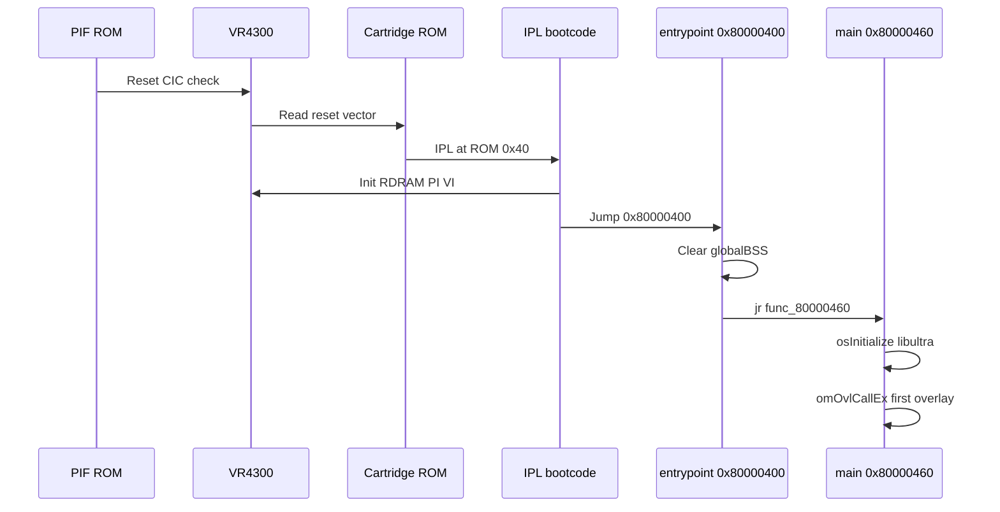
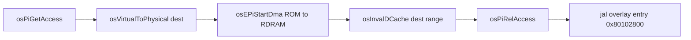

# Boot and Cartridge Interface

From power-on to `omOvlCallEx` — how Mario Party 2 reaches main code and loads overlays from ROM.

## Boot Chain Overview

## Stage 1: PIF and CIC

The **PIF** (peripheral interface firmware) chip on the console motherboard:

1. Validates the cartridge **CIC** (lockout chip) against the console region
2. Holds the VR4300 in reset until checks pass
3. Releases CPU to fetch from the reset vector

Failure produces the blank or “no game” screen — no MP2 code runs.

## Stage 2: IPL (Initial Program Load)

The first code executed is the **IPL** in the cartridge header region. MP2 config ([`marioparty2.yaml`](../../marioparty2.yaml)) places the `boot` segment at ROM **`0x40`**.

The IPL (Nintendo-provided, linked into every cart):

- Initializes RDRAM controller
- Sets minimal TLB mappings
- Copies game-specific boot data
- Transfers control to the game entry point

## Stage 3: Cartridge Header

[`asm/header.s`](../../asm/header.s) defines the 64-byte ROM header:

| Field | MP2 value | Meaning |
|-------|-----------|---------|
| Entry point | `0x80000400` | First game code in KSEG0 |
| Internal name | `MarioParty2` | 20-byte title |
| Cartridge ID | `NMWE` | USA retail |
| Country | `E` | North America |

The header also stores PI timing (`0x80371240`) and clock rate used by IPL.

## Stage 4: Game Entrypoint

[`asm/entrypoint.s`](../../asm/entrypoint.s) at **`0x80000400`** runs before libultra:

1. **`$t0` ← `0x800D4BF0`** — start of `globalBSS`
2. **`$t1` ← `0x2DC10`** — byte count (cleared in 8-byte steps)
3. Loop stores zero pairs until BSS is cleared
4. **`$sp` ← `0x800FC730`** (delay slot of final `jr`)
5. **`jr $t2`** → **`0x80000460`** (main segment entry)

This ensures uninitialized BSS does not contain garbage before C runtime and libultra init.

## Stage 5: libultra and Engine Init

Main code @ `0x80000460` calls `osInitialize`, creates threads, initializes VI/PI/SI managers, then Hudson engine init (`InitObjSys`, heaps, etc.). See [../02-boot-and-init.md](../02-boot-and-init.md) for the software sequence.

First overlay dispatch: **`omOvlCallEx`** loads title screen (`ovl_62`) or debug menu (`ovl_00`).

## Peripheral Interface (PI)

The **PI** block DMAs data between **cartridge ROM** and **RDRAM**. It is the hardware path for:

- Main segment load at boot (IPL)
- **Overlay swaps** during gameplay
- **Asset streaming** from high ROM addresses

### libultra PI API (MP2 symbols)

| Function | VRAM | Role |
|----------|------|------|
| `osEPiStartDma` | `0x8009DC00` | Managed cartridge DMA (6 calls in main) |
| `osPiRawStartDma` | `0x800A82E0` | Low-level PI DMA |
| `osPiGetAccess` / `osPiRelAccess` | `0x8009E208` / `0x8009E2A0` | PI bus mutex |
| `osEPiReadIo` / `osEPiWriteIo` | `0x8009DBA0` / `0x8009DB40` | Register peek/poke |

PI manager thread serializes DMA requests so overlay loads do not collide with asset reads.

### Typical DMA Sequence

After DMA, **`osInvalDCache`** ensures the CPU does not execute stale instructions from cache lines filled before the DMA completed.

## Overlay Load Path (`omOvlCallEx`)

Software flow (engine doc + hardware):

1. Index **overlay table** @ VRAM `0x800CAD90` (ROM `0xC9474`)
2. Read `romStart`, `romEnd`, `vramText` for overlay ID
3. PI DMA cart range → **`0x80102800`**
4. Invalidate I/D cache for loaded range
5. Call overlay entry with `(event, stat)` arguments

All 115 overlays share the **same VRAM text address** — only one resident at a time ([`marioparty2.yaml`](../../marioparty2.yaml) `vram: 0x80102800`).

## MainFS and Asset ROM

Beyond code overlays, PI DMA also pulls compressed files from the asset region (ROM `0x418A50+`). `ReadMainFS` / `HuMemDirectMalloc` paths decompress into RDRAM heaps — same PI hardware, different ROM offsets.

## SDK Dead Code (64DD / Leo)

The ROM links **Leo (64DD disk drive)** libultra symbols but MP2 is cartridge-only — **6** Leo `jal`s in main, no gameplay dependency. See [31-unused-libultra-leo-64dd.md](31-unused-libultra-leo-64dd.md). **Expansion Pak (8 MB)** is not used; see [02-memory-map.md](02-memory-map.md).

## Related Docs

- [31-unused-libultra-leo-64dd.md](31-unused-libultra-leo-64dd.md) — Leo/64DD and Expansion Pak
- [02-memory-map.md](02-memory-map.md) — Overlay window and table
- [01-vr4300-cpu.md](01-vr4300-cpu.md) — Cache ops after DMA
- [../02-boot-and-init.md](../02-boot-and-init.md) — Engine init order
- [../07-minigame-framework.md](../07-minigame-framework.md) — Overlay lifecycle
- [call-inventory.md](call-inventory.md) — PI function call counts
