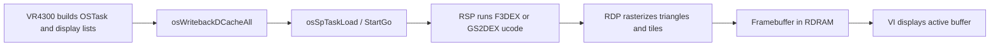

# RCP: RSP and RDP

The **Reality Coprocessor** splits into the **RSP** (programmable scalar/vector processor) and **RDP** (fixed-function rasterizer). Mario Party 2 renders through **F3DEX2** and **GS2DEX2** microcode (`-DF3DEX_GBI_2` in the [Makefile](../../Makefile)).

## Pipeline

The CPU never draws pixels directly. It prepares **GBI display lists** in RDRAM; the RSP interprets opcodes; the RDP writes color and Z to the framebuffer.

## RSP (Reality Signal Processor)

| Resource | Size | Use |
|----------|------|-----|
| IMEM | 4 KB | Microcode instructions loaded per task |
| DMEM | 4 KB | RSP scratch, stack, small buffers |
| RDRAM | 4–8 MB | Display lists, vertices, textures |

### Microcode Variants in MP2

| Ucode | GBI | Typical content |
|-------|-----|-----------------|
| F3DEX2 | 3D | Characters, board props, 3D minigame geometry |
| GS2DEX2 | 2D | Board backgrounds, UI tiles, HVQ-decompressed maps |

Board scenes often combine **GS2DEX** background layers with **F3DEX** character models in the same frame (multiple tasks or merged lists).

### libultra RSP Task Protocol

| Function | VRAM | Calls (main) | Purpose |
|----------|------|--------------|---------|
| `osSpTaskLoad` | `0x800A5C0C` | 0 | Load `OSTask` into SP registers |
| `osSpTaskStartGo` | `0x800A5BE0` | 3 | Start or continue ucode |
| `osSpTaskYield` | `0x800A5E20` | 1 | Cooperative yield |
| `osSpTaskYielded` | `0x800A5E40` | 1 | Check yield status |
| `osSpRawStartDma` | `0x800ADE00` | 2 | IMEM/DMEM DMA |

Typical submit sequence in main (~`0x8007E7B8` region):

1. Build `OSTask` pointing at ucode, display list, output buffer
2. **`osWritebackDCacheAll`** — flush CPU writes visible to RSP
3. **`osSpTaskYield`** — if previous task still running, wait/yield
4. **`osSpTaskStartGo`** — RSP begins consuming display list

### OSTask Structure (Conceptual)

| Field | Role |
|-------|------|
| `type` | M_GFXTASK / M_AUDTASK |
| `flags` | Yield, bootstrap flags |
| `ucode` | IMEM entry for F3DEX/GS2DEX |
| `ucode_data` | DMEM init data |
| `data_ptr` / `data_size` | Display list in RDRAM |
| `yield_data_ptr` | Yield buffer for multi-task ucode |

MP2 does not call RSP registers directly — all access goes through libultra.

## RDP (Reality Display Processor)

The RDP reads RSP output and performs:

- Triangle setup and rasterization
- Texture sampling (point/linear)
- Alpha blend, Z compare
- Scissor and viewport clipping

Engine helpers **`ScissorSet`** and **`ViewportSet`** emit GBI commands that configure RDP clip state inside the display list — no direct `0xA4100000` register pokes in game symbols.

### Framebuffers

Double-buffered color buffers in RDRAM. **`osViSwapBuffer`** (VI doc) points the display at the front buffer while the RDP fills the back buffer.

## MP2 Rendering Paths

| Scene type | CPU work | RSP ucode |
|------------|----------|-----------|
| Board map | HVQ decompress → tile upload | GS2DEX2 |
| Board characters | Animation, matrix setup | F3DEX2 |
| Minigame 3D | Overlay `.data` display lists | F3DEX2 |
| Menus / 2D FX | Sprite rects, fade quads | GS2DEX2 |

Expand on engine-level flow in [../08-rendering.md](../08-rendering.md).

## Cache Coherency (Critical)

The RSP reads RDRAM **without** seeing CPU D-cache. Every display-list build must be followed by writeback before `osSpTaskStartGo`. Conversely, after RSP writes (rare for gfx tasks), the CPU may need `osInvalDCache`.

## Related Docs

- [07-graphics-pipeline-overview.md](07-graphics-pipeline-overview.md) — Full end-to-end graphics flow
- [08-gbi-rsp-microcode.md](08-gbi-rsp-microcode.md) — GBI commands and RSP detail
- [09-rdp-framebuffers-pixel-formats.md](09-rdp-framebuffers-pixel-formats.md) — RDP rasterization
- [05-video-and-audio-io.md](05-video-and-audio-io.md) — VI swap and timing
- [01-vr4300-cpu.md](01-vr4300-cpu.md) — Cache operations
- [../08-rendering.md](../08-rendering.md) — Engine render API
- [call-inventory.md](call-inventory.md) — SP call inventory
