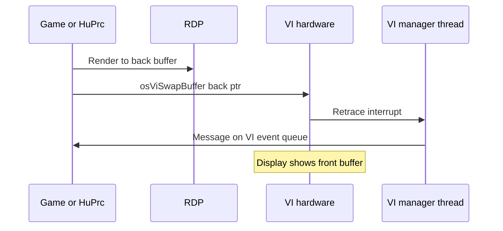
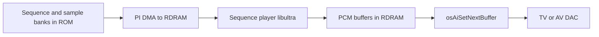

# Video and Audio I/O

The **VI** (Video Interface) drives the TV signal; the **AI** (Audio Interface) streams PCM to the DAC. Both connect to libultra manager threads and explain MP2 frame pacing (`SleepVProcess`) and music playback.

## Video Interface (VI)

### Role

The VI reads a **framebuffer** in RDRAM and generates **NTSC** (or PAL) timing:

- Common modes: 640×480 interlaced, 320×240 progressive (many N64 titles)
- **~60 Hz** field rate on NTSC — source of “vsync” for games

### libultra VI API (MP2)

| Function | VRAM | Calls (main) | Purpose |
|----------|------|--------------|---------|
| `osViSetMode` | `0x800A6E50` | 2 | Set resolution/timing |
| `osViSwapBuffer` | `0x800A7060` | 2 | Flip front/back pointer |
| `osViSetEvent` | `0x800A6DF0` | 1 | Retrace → message queue |
| `osViBlack` | `0x800A73C0` | 1 | Blank screen (transitions) |
| `osViGetCurrentFramebuffer` | `0x800A6A30` | 0 | Query active buffer |
| `osViSetYScale` | `0x800A7010` | 0 | Vertical scale |

### Double Buffering

`osViSwapBuffer` does not block until the next retrace by itself — games often **`osRecvMesg`** on the VI queue or use **`SleepVProcess`** to align logic to 60 Hz.

### MP2 Frame Pacing

Engine **`SleepVProcess`** waits on the process timer tied to retrace cadence. Hardware path:

1. VI asserts interrupt at field boundary
2. libultra maps VI → `OS_EVENT_VI` via **`osSetEventMesg`**
3. Waiting threads wake; HuPrc scheduler runs next slice

During overlay fades, **`osViBlack`** blanks output while PI DMA loads the next overlay — avoids showing garbage mid-load.

## Audio Interface (AI)

### Role

The AI pulls **PCM samples** from RDRAM via DMA and feeds the **44.1 kHz** (typical) DAC. Playback is **buffered**: while one buffer plays, the CPU fills the next.

### libultra AI API

| Function | VRAM | Notes |
|----------|------|-------|
| `osAiSetFrequency` | (libultra) | Sample rate setup |
| `osAiSetNextBuffer` | (libultra) | Queue next PCM region |
| `osAiGetLength` | `0x8009E2D0` | Remaining samples in current buffer |

MP2 engine APIs **`PlaySound`**, **`PlayMusic`**, **`FadeSong`** sit above the sequence player — they index tables in ROM asset banks, not raw AI registers.

### Audio Data Flow

Minigame and board music share the same AI path; overlay code triggers engine sound IDs rather than calling `osAi*` directly in most cases.

## MI: Master Interrupt

The **MIPS Interface** (`0xA4300000`) masks and routes interrupts from VI, SI, AI, SP, DP, PI, and the RCP compare register. libultra **`osSetEventMesg`** converts hardware IRQs into **`OSMesg`** for manager threads — game logic rarely installs custom ISRs.

See [06-serial-save-interrupts.md](06-serial-save-interrupts.md) for the full interrupt model.

## Related Docs

- [10-vi-display-modes.md](10-vi-display-modes.md) — Exhaustive OSViMode and NTSC/PAL reference
- [07-graphics-pipeline-overview.md](07-graphics-pipeline-overview.md) — Per-frame timeline
- [04-rcp-rsp-rdp.md](04-rcp-rsp-rdp.md) — Framebuffer production
- [../08-rendering.md](../08-rendering.md) — Engine graphics
- [../09-audio.md](../09-audio.md) — PlaySound / PlayMusic API
- [call-inventory.md](call-inventory.md) — VI/AI symbol table
