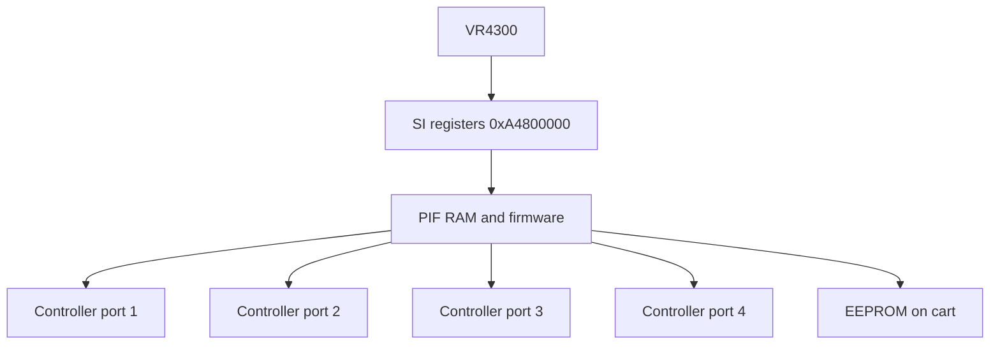

# Serial I/O, Save Hardware, and Interrupts

Controllers, EEPROM saves, and how libultra turns hardware IRQs into messages MP2 can poll or wait on.

## Serial Interface (SI)

The **SI** connects the VR4300 to the **PIF**, which implements the serial bus for:

- **4 controller ports** (N64 pads)
- **EEPROM** (4 Kbit on-cart save for MP2)
- Optional **Controller Pak** (256 Kbit RAM cart)

All devices share one serial protocol — only one transaction at a time, managed by libultra’s SI/PIF driver.

## Controller Input Path

| Function | VRAM | Calls (main) | Role |
|----------|------|--------------|------|
| `osContStartReadData` | `0x800A1FBC` | 2 | Begin pad poll |
| `osContGetReadData` | `0x800A1F20` | 2 | Read `OSContPad` array |

Typical frame loop:

1. SI manager (or game) calls **`osContStartReadData`**
2. PIF exchanges data with each connected controller
3. Game calls **`osContGetReadData`** → button/stick state

MP2 engine wraps this in higher-level input (`GwPlayer` button fields, minigame-specific readers). Hardware doc: the **physical** path is SI → PIF → controller pak edge connector.

### Controller Pak (Optional)

| Function | VRAM | Purpose |
|----------|------|---------|
| `osContRamRead` | `0x800A7820` | Read pak SRAM |
| `osContRamWrite` | `0x800A7A10` | Write pak SRAM |

MP2 primary save uses **EEPROM**, not Controller Pak — pak functions exist for compatibility or unused features.

## EEPROM Save Hardware

Mario Party 2 stores progress on a **4 Kbit (512 byte) EEPROM** inside the cartridge, accessed via the same SI/PIF bus as controllers.

| Function | VRAM | Role |
|----------|------|------|
| `osEepromProbe` | `0x8009CAD0` | Detect EEPROM presence |
| `osEepromRead` | `0x800A8030` | Read 8-byte block |
| `osEepromWrite` | `0x8009C720` | Write 8-byte block |
| `osEepromLongRead` | `0x8009CC40` | Multi-block read |
| `osEepromLongWrite` | `0x8009CB50` | Multi-block write |

### Software vs Hardware Save

| Layer | Location | Content |
|-------|----------|---------|
| Hardware | EEPROM silicon | Raw 512 bytes |
| libultra | `osEeprom*` | Block protocol, checksum |
| MP2 engine | `GW_PLAYER`, options structs | Parsed game state |

Engine **`ReadEeprom`** / **`WriteEeprom`** (see [../10-input-and-save.md](../10-input-and-save.md)) serialize structs to EEPROM blocks — the VR4300 never bit-bangs SI directly in game code.

## Interrupt Model

### Hardware Sources

| IRQ | Device | MP2 relevance |
|-----|--------|---------------|
| VI | Display retrace | Frame sync, `SleepVProcess` |
| SI | PIF transaction done | Controller read completion |
| AI | Audio buffer empty | Stream next PCM buffer |
| SP | RSP task done/yield | Graphics task chain |
| DP | RDP sync | Rare direct use |
| PI | Cartridge DMA done | Overlay/asset load completion |
| Compare | CPU timer | libultra timer services |

### libultra Mapping

**`osSetEventMesg`** @ `0x800A5AF0` registers which **`OSMesgQueue`** receives each event type. Manager threads block on **`osRecvMesg`**; they perform the second half of I/O (e.g., finalize SI read).

MP2 **game logic** mostly:

- **Polls** controllers after the OS has refreshed `OSContPad`
- **Sleeps** HuPrc processes on timers aligned to VI
- **Does not** install custom exception handlers for SI/VI

True preemptive threads (VI manager, PI manager, idle) run on the same VR4300 via exception dispatch — see [01-vr4300-cpu.md](01-vr4300-cpu.md).

### OS Threads (Reference)

| Function | VRAM | Role |
|----------|------|------|
| `osCreateThread` | `0x800A6030` | Create thread control block |
| `osSetEventMesg` | `0x800A5AF0` | IRQ → message queue |
| `osRecvMesg` / `osSendMesg` | libultra | Inter-thread sync |

## HuPrc vs Hardware Threads

| Mechanism | Parallelism | Used for |
|-----------|-------------|----------|
| HuPrc (`InitProcess`) | Cooperative coroutines | Minigame logic, board objects |
| libultra threads | Preemptive on IRQ | VI, PI, SI, audio |

Do not confuse **`SleepProcess`** (engine yield) with **`osStopThread`** (OS primitive).

## Related Docs

- [../10-input-and-save.md](../10-input-and-save.md) — Engine input and save API
- [../03-process-system.md](../03-process-system.md) — HuPrc scheduling
- [05-video-and-audio-io.md](05-video-and-audio-io.md) — VI/AI events
- [call-inventory.md](call-inventory.md) — SI/EEPROM call counts
