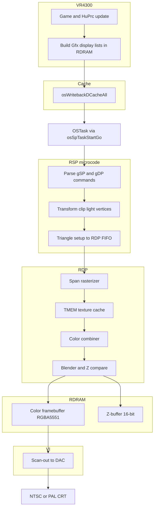
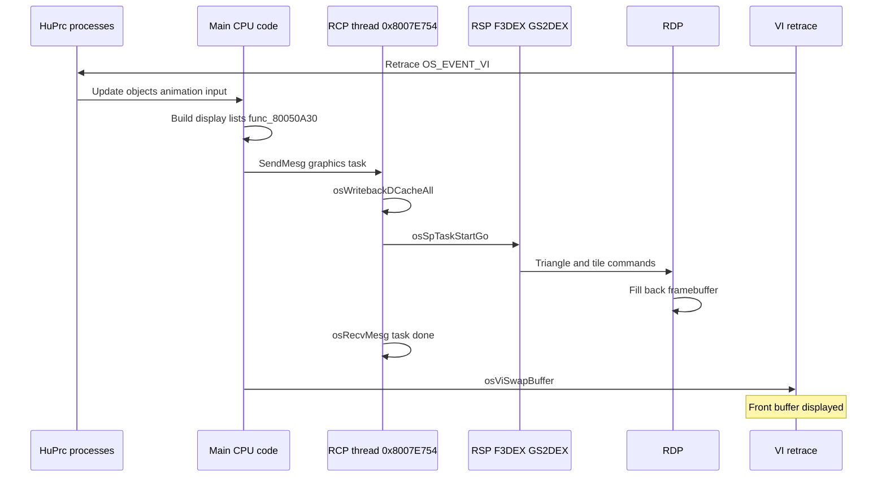

# N64 Graphics Pipeline Overview

End-to-end view of how Mario Party 2 produces a frame — from CPU display lists through the RCP to the VI and CRT.

## Core Principles

### Unified memory (no VRAM chip)

Unlike contemporary PCs or PlayStation, the N64 has **no dedicated video RAM**. Color buffers, Z-buffers, textures, vertices, and display lists all live in **RDRAM**. The VR4300, RSP, RDP, and VI DMA from the same pool. This simplifies asset management but makes **cache coherency** mandatory: the CPU D-cache is invisible to the RCP.

### Command buffering (GBI display lists)

The CPU does not draw pixels. It appends **64-bit `Gfx` commands** into display lists in RDRAM — the Graphics Binary Interface (GBI). Each command is either handled by **RSP microcode** (geometry, matrix, state) or forwarded to the **RDP** (raster, texture, blend). See [08-gbi-rsp-microcode.md](08-gbi-rsp-microcode.md).

### Split coprocessor: RSP + RDP

| Unit | Role | Programmability |
|------|------|-----------------|
| **RSP** | Transform vertices, clip, light, parse GBI, feed RDP | Microcode (F3DEX2, GS2DEX2 in MP2) |
| **RDP** | Rasterize spans, sample textures, combine colors, blend, write pixels | Fixed-function; combiner equations configured via GBI |

The RSP is a scalar/vector MIPS-like processor with 4 KB IMEM + 4 KB DMEM. The RDP is a hardwired rasterizer with a **4 KB TMEM** texture cache.

### TMEM as the bandwidth bottleneck

Textures must pass through **TMEM** (4096 bytes, often split 2 KB + 2 KB for two tiles) before the RDP can sample them. Large or frequently changing textures cause **tile thrashing** — repeated `gDPLoadTile` / `gDPLoadBlock` stalls. Board backgrounds in MP2 use small HVQ tiles partly for this reason.

### Cache coherency before RCP reads

After the CPU writes display lists or vertex buffers:

1. **`osWritebackDCacheAll`** or targeted `osWritebackDCache` — flush CPU writes to RDRAM
2. **`osSpTaskStartGo`** — RSP reads from physical RDRAM

Missing writeback produces corrupted geometry or black screens. MP2's RCP worker calls `osWritebackDCacheAll` at **`0x8007E7B8`** before every task submit.

### XBus vs YPipe

The RDP connects to RDRAM via **XBus** (default) or **YPipe** (alternate bus timing). Almost all retail games use XBus. YPipe can improve fill rate in specific scenarios but requires explicit setup. MP2 uses standard libultra defaults (XBus).

## Full Pipeline

## Data Flow Summary

| Stage | Input | Output |
|-------|-------|--------|
| CPU | Game state, asset pointers | `Gfx[]` display list, `Vtx[]` buffers |
| RSP | Display list + vertices | RDP commands (triangles, rects, state) |
| RDP | RDP commands + TMEM tiles | Pixel writes to color/Z in RDRAM |
| VI | Framebuffer pointer in RDRAM | Analog video signal (~60 Hz field rate) |

## One MP2 Frame (Timeline)

Typical gameplay frame, tying engine and hardware:

### RCP worker thread (`0x8007E754`)

MP2 runs a dedicated **graphics thread** at `func_8007E754` in [`asm/1060.s`](../../asm/1060.s):

1. **`osRecvMesg`** — wait for `OSTask*` from game code
2. **`osWritebackDCacheAll`** — coherency flush
3. **`osSpTaskYield`** / **`osSpTaskYielded`** — if a previous task is still running, cooperative yield
4. **`osSpTaskStartGo`** — start RSP (up to **three** submits per loop iteration for queued tasks)
5. **`osSendMesg`** — notify completion to caller's queue @ `D_800EB950`

A secondary submit path @ `0x8007E8D4` also writebacks before starting tasks under interrupt mask.

### Scene composition (MP2)

| Layer | Ucode | Source |
|-------|-------|--------|
| Board background tiles | GS2DEX2 | HVQ-decompressed MainFS → RDRAM textures |
| 3D characters / props | F3DEX2 | Overlay `.data` display lists + models |
| UI / fade quads | GS2DEX2 | `InitFadeIn` / `InitFadeOut` full-screen rects |
| Minigame geometry | F3DEX2 | Active overlay @ `0x80102800` |

Layers may be separate RSP tasks or merged display lists depending on scene.

## Buffering Strategies

### Double buffering (standard)

| Buffer | Role |
|--------|------|
| **Front** | VI reads this for display (read-only during scan) |
| **Back** | RDP renders here; swapped with `osViSwapBuffer` at frame boundary |

Pointers must be **8-byte aligned**. Typical size for 320×240 RGBA5551: `320 × 240 × 2 = 153,600` bytes (~150 KB) per buffer.

### Z-buffer

- **16-bit** fixed-point depth, same width×height as color buffer
- Enabled with **`G_ZBUFFER`** geometry mode
- Cleared with `gDPSetFillColor` + fill rect or dedicated clear pass
- MP2 board scenes often clear Z each frame; UI overlays may disable Z

### When to clear vs preserve

| Scenario | Typical approach |
|----------|------------------|
| Full 3D scene | Clear color + Z at frame start |
| 2D board (GS2DEX full screen) | Background covers framebuffer; Z may be unused |
| Fade transition | Draw black/color quad over entire buffer |
| Multipass effects | Preserve Z for second pass (rare on N64) |

## Build Configuration

MP2 decomp uses **GBI 2** via `-DF3DEX_GBI_2` in the [Makefile](../../Makefile). This selects F3DEX2/GS2DEX2 microcode and GBI-2 opcode layouts.

## Graphics Doc Index

| Doc | Topic |
|-----|-------|
| [08-gbi-rsp-microcode.md](08-gbi-rsp-microcode.md) | GBI commands, RSP stages, OSTask |
| [09-rdp-framebuffers-pixel-formats.md](09-rdp-framebuffers-pixel-formats.md) | TMEM, combiner, blender, pixel formats |
| [10-vi-display-modes.md](10-vi-display-modes.md) | OSViMode, NTSC/PAL, MP2 mode table |
| [04-rcp-rsp-rdp.md](04-rcp-rsp-rdp.md) | Shorter RCP summary |
| [../08-rendering.md](../08-rendering.md) | MP2 engine render API |
