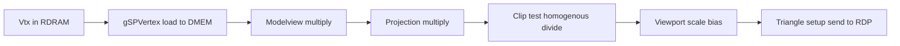

# GBI and RSP Microcode

How 64-bit Graphics Binary Interface commands drive the RSP — and which microcode Mario Party 2 uses.

## GBI Command Model

Every graphics operation is a **64-bit word** (`Gfx` / `u64`). The high byte is the **command opcode**; remaining bits are parameters.

```
 63        56 55                    0
+----------+------------------------+
|  cmd (8) |     parameters (56)    |
+----------+------------------------+
```

Commands fall into three namespaces:

| Prefix | Processed by | Examples |
|--------|--------------|----------|
| **`gSP*`** | RSP microcode | Vertices, matrices, geometry mode, branch |
| **`gDP*`** | RSP forwards to RDP | Textures, tiles, combiner, render mode, scissor |
| **`gsSP*` / `gsDP*`** | C preprocessor macros | Expand to one or more `Gfx` words |

The RSP parses the display list sequentially. **`gDP*`** commands are written into the **RDP command FIFO** for the rasterizer to consume.

## GBI 1 vs GBI 2

Mario Party 2 is built with **GBI 2** (`-DF3DEX_GBI_2` in the [Makefile](../../Makefile)).

| Change (GBI 2) | Impact |
|----------------|--------|
| `gSPVertex(v, n, v0)` | Vertex index base `v0` explicit |
| `gSPModifyVertex` | Per-vertex texcoord/color patch |
| `gSPPopMatrix` | Pops modelview stack |
| Triangle macros | `gSP1Triangle`, `gSP2Triangles` opcode layout |
| `gSPLoadUcode` | Dynamic ucode swap (rare in games) |

Decomp headers must use **`gbi-2.h`** / F3DEX2 symbols — mixing GBI-1 macros with F3DEX2 ucode breaks display lists.

## Essential GBI Commands

### Segments and display lists

| Command | Purpose |
|---------|---------|
| `gSPSegment(seg, base)` | Map segment `0–15` to RDRAM base (address >> 24 in upper bits) |
| `gSPDisplayList(dl)` | Jump to linked list (push return address) |
| `gSPBranchList(dl)` | Jump without return |
| `gSPBranchLessZ(...)` | Conditional branch on Z (microcode-dependent) |
| `gSPEndDisplayList()` | Terminate list |

Segments let display lists use 24-bit pointers (`0x08xxxxxx` → segment 8). MP2 overlays reference `.data` via segment setup in init code.

### Geometry (3D — F3DEX2)

| Command | Purpose |
|---------|---------|
| `gSPVertex(vtx, n, v0)` | Load `n` vertices from RDRAM `Vtx[]` into RSP vertex buffer |
| `gSP1Triangle(v0,v1,v2, flag)` | Draw one triangle from buffered vertices |
| `gSP2Triangles(...)` | Draw two triangles (shared edge optimization) |
| `gSPMatrix(mtx, mode)` | Multiply modelview or projection matrix |
| `gSPPopMatrix(n)` | Pop matrix stack (GBI 2) |
| `gSPTexture(s, t, level, tile)` | Texture scale and tile select |
| `gSPSetGeometryMode(mode)` | Enable Z, shading, culling, fog, etc. |
| `gSPClearGeometryMode(mode)` | Disable geometry flags |
| `gSPSetLights(n)` / light vectors | Per-vertex lighting |

### RDP setup (via display list)

| Command | Purpose |
|---------|---------|
| `gDPSetCombineMode(cm, ac)` | Color combiner equation |
| `gDPSetRenderMode(rm, rm2)` | Blender / cycle / AA mode |
| `gDPSetTextureImage(fmt, size, width, addr)` | Source texture in RDRAM |
| `gDPSetTile(fmt, siz, line, tmem, tile, ...)` | Tile descriptor in TMEM |
| `gDPLoadTile` / `gDPLoadBlock` | DMA texture data into TMEM |
| `gDPSetScissor(mode, ulx, uly, lrx, lry)` | Clip rectangle |
| `gDPSetPrimColor(level, m, r, g, b, a)` | Primitive color / LOD fraction |
| `gDPSetEnvColor(r, g, b, a)` | Environment color (combiner input) |
| `gDPSetFillColor(color)` | Fill rectangle color |
| `gDPFillRectangle(ulx, uly, lrx, lry)` | Solid fill (fast clear) |
| `gDPTextureRectangle(...)` | Copy/sprite blit |
| `gDPPipeSync()` | Wait for RDP pipe drain |
| `gDPFullSync()` | Wait for RDP memory write complete |

### 2D objects (GS2DEX2)

| Command | Purpose |
|---------|---------|
| `gSPObjRectangle*` | Axis-aligned sprite quad |
| `gSPObjSprite` | Scaled sprite |
| `gSPObjMatrix` | 2D object transform |
| `gSPObjRenderMode` | Obj blend / depth flags |
| `gSPObjLoadTxtr` / `gSPObjLoadTxSprite` | Load object texture |

MP2 board backgrounds use GS2DEX **object lists** pointing at decompressed HVQ tile data in RDRAM.

## RSP Execution Model

### Memory

| Space | Size | Contents during gfx task |
|-------|------|--------------------------|
| IMEM | 4 KB | F3DEX2 or GS2DEX2 microcode |
| DMEM | 4 KB | Stack, vertex cache, RSP globals |
| RDRAM | 4–8 MB | Display lists, vertices, matrices, textures |

`osSpTaskLoad` DMAs ucode bootstrap + sets PC. Bulk geometry stays in RDRAM.

### Display list parser loop

Microcode main loop:

1. Fetch next 64-bit `Gfx` word from RDRAM
2. Decode opcode
3. If **`gSP*`**: execute (matrix, vertex load, triangle)
4. If **`gDP*`**: write to RDP FIFO (may stall if FIFO full)
5. If branch/end: adjust PC or halt

### Vertex transform pipeline (F3DEX2)



**Vtx** structure (typical, 16 bytes):

| Field | Size | Role |
|-------|------|------|
| `v.ob[0..2]` | s16×3 | Position (model space) |
| `v.flag` | s16 | Clip / lighting flags |
| `v.tc[0..1]` | s16×2 | Texture coordinates |
| `v.cn[0..3]` | u8×4 | RGBA color / normal components |

### Lighting

When `G_LIGHTING` geometry mode is set, microcode applies directional/ambient lights from `gSPSetLights` state. Output is **per-vertex color** (`Shade`) fed to the RDP combiner. MP2 characters on boards typically use lit F3DEX2 meshes.

### Triangle setup

Clipped triangles become **edge equations** and **span descriptors** sent to the RDP. The RSP does not write pixels — only the RDP does.

## Microcode Catalogue

| Microcode | GBI | Typical use |
|-----------|-----|-------------|
| F3D / Fast3D | 1 | Early titles (SM64 JP) |
| **F3DEX** | 1 | Standard 3D |
| **F3DEX2** | 2 | **MP2 3D content** |
| F3DEX2.Rej | 2 | Reject box culling variant |
| S2DEX | 1 | 2D sprites |
| **GS2DEX** | 1/2 | 2D objects |
| **GS2DEX2** | 2 | **MP2 board backgrounds** |
| L3DEX | 1 | Line / debug vectors |
| S3DEX / S3DEX2 | 1/2 | Simplified 3D (fewer features) |

MP2 Makefile defines **`F3DEX_GBI_2`** — link F3DEX2 + GS2DEX2 object files from the SDK ucode library (when building matched ROM).

## OSTask and Scheduling

### M_GFXTASK structure (conceptual)

| Offset field | Role |
|--------------|------|
| `type` | `M_GFXTASK` (1) |
| `flags` | `OS_TASK_YIELDED`, `OS_TASK_DP_WAIT` |
| `ucode_boot` | Bootstrap loader IMEM |
| `ucode` / `ucode_size` | Microcode IMEM image |
| `ucode_data` / `ucode_data_size` | DMEM init |
| `data_ptr` / `data_size` | Display list RDRAM pointer |
| `yield_data_ptr` | Save buffer for yield |

### libultra API (MP2 VRAM)

| Function | Address | Role |
|----------|---------|------|
| `osSpTaskLoad` | `0x800A5C0C` | Load task into SP hardware |
| `osSpTaskStartGo` | `0x800A5BE0` | Start execution |
| `osSpTaskYield` | `0x800A5E20` | Request yield (multi-task ucode) |
| `osSpTaskYielded` | `0x800A5E40` | Test if task yielded |

### Yield path (MP2 @ `0x8007E7D0`)

When a task is already running (`D_800ECAD4` non-null):

1. **`osSpTaskYield`**
2. **`osRecvMesg`** on RCP queue — wait for SP interrupt
3. **`osSpTaskYielded`** — verify yield completed
4. Then **`osSpTaskStartGo`** for the new task

### MP2 RCP thread

| Symbol | VRAM | Role |
|--------|------|------|
| `func_8007E754` | `0x8007E754` | RCP worker thread entry |
| `D_800EB950` | `0x800EB950` | RCP command mesg queue |
| `D_800ECAD0` | `0x800ECAD0` | Current running `OSTask*` |
| `func_80050A30` | `0x80050A30` | Display-list builder / submit helper (3 call sites in main) |

Game code builds display lists, queues an `OSTask`, and sends a message to the RCP thread — keeping **long RSP runs off the HuPrc stack**.

## MP2 Evidence

- Overlay `.data` sections contain raw **`gsSP*`** / **`gsDP*`** words in [`asm/overlays/`](../../asm/overlays/)
- Board tiles: CPU decompresses HVQ → uploads via `gDPLoadBlock` → GS2DEX2 object draw
- Engine **`ScissorSet`** / **`ViewportSet`** emit GBI scissor/viewport commands before geometry
- **`func_80018E30`** — matrix / camera setup feeding F3DEX2 lists

## Related Docs

- [07-graphics-pipeline-overview.md](07-graphics-pipeline-overview.md) — End-to-end flow
- [09-rdp-framebuffers-pixel-formats.md](09-rdp-framebuffers-pixel-formats.md) — What happens after RSP setup
- [04-rcp-rsp-rdp.md](04-rcp-rsp-rdp.md) — Shorter RCP summary
