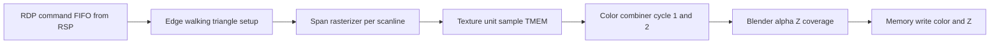

# RDP, Framebuffers, and Pixel Formats

The Reality Display Processor turns RSP triangle setup into RDRAM pixels — combiner, blender, TMEM, and buffer layout.

## RDP Internal Pipeline



The RDP is **fixed-function** but highly configurable via GBI. Game code never touches DP registers (`0xA4100000`) directly in MP2 — all setup is through display lists.

## TMEM (Texture Memory)

| Property | Value |
|----------|-------|
| Total size | **4096 bytes** |
| Typical layout | Tile 0: 0x000–0x7FF (2 KB), Tile 1: 0x800–0xFFF (2 KB) |
| Load path | `gDPSetTextureImage` → `gDPSetTile` → `gDPLoadTile` / `gDPLoadBlock` |

### Why TMEM matters

The RDP cannot sample directly from RDRAM every pixel at full rate. Textures must be **tiled into TMEM** first. If a triangle uses a 256×256 RGBA texture, it cannot fit — artists split into smaller tiles (MP2 HVQ board tiles ~32×32 regions).

**Thrashing**: switching textures every triangle forces constant reloads → major slowdown.

### Tile descriptors

`gDPSetTile` configures:

| Parameter | Role |
|-----------|------|
| `fmt` | Color format (RGBA, CI, IA, …) |
| `siz` | Pixel size (4/8/16/32 bpp) |
| `line` | Bytes per row in TMEM |
| `tmem` | TMEM offset (multiple of 8) |
| `palette` | TLUT index for CI formats |
| `cmt` / `cms` | Mirror/wrap/clamp S/T |
| `maskt` / `masks` | Coordinate wrap mask |

## Color Combiner

The combiner builds **output color** from two RGBA inputs per cycle using a programmable equation.

### Inputs

| Input | Source |
|-------|--------|
| **Texel0** | Texture sample tile 0 |
| **Texel1** | Texture sample tile 1 (2-cycle or detail) |
| **Shade** | Interpolated vertex color (lighting) |
| **Env** | `gDPSetEnvColor` |
| **Prim** | `gDPSetPrimColor` |
| **Noise** | Dither noise |
| **LOD** | Level-of-detail fraction |

### Common combine modes

| Mode macro | Visual result |
|------------|---------------|
| `G_CC_MODULATEI` | Texture × shade (standard lit textured surface) |
| `G_CC_DECALRGBA` | Texture alpha over shade |
| `G_CC_PRIM` | Solid primitive color |
| `G_CC_SHADE` | Vertex color only (untextured) |
| `G_CC_ENVIRONMENT` | Environment color (skybox reflection) |
| `G_CC_TEXGEN` | Environment-mapped reflection |

Set via **`gDPSetCombineMode(G_CC_*, G_CC_*)`** — second arg is alpha combiner.

### Cycles

| Mode | Description |
|------|-------------|
| **1-cycle** | One combiner pass per pixel (faster) |
| **2-cycle** | Two passes — e.g. modulate then add detail texture |

## Blender

The blender merges combiner output with **framebuffer** and **Z-buffer**.

### Operations

| Feature | GBI / mode flag |
|---------|-----------------|
| Z-buffer test | `G_ZBUFFER` geometry mode + `G_RM_*Z*`` render mode |
| Z write | `G_ZUPD` in render mode |
| Alpha compare | `G_AC_*` — reject below threshold |
| Alpha blend | `G_BL_*` source/dest factors |
| Coverage | Anti-aliased edges (coverage values from subpixels) |

### Render mode presets

`gDPSetRenderMode(rm, rm2)` selects blender behavior:

| Preset | Use |
|--------|-----|
| `G_RM_OPA_SURF` | Opaque textured surfaces (Z on, no blend) |
| `G_RM_AA_ZB_OPA_SURF` | Opaque + RDP anti-alias + Z |
| `G_RM_XLU_SURF` | Alpha-blended transparent |
| `G_RM_DECAL` | Decal over existing color |
| `G_RM_ADD` | Additive blend (glow, particles) |
| `G_RM_PASS` | 1st cycle of 2-cycle path |

### Z-buffer

| Property | Value |
|----------|-------|
| Format | **16-bit** fixed-point depth |
| Resolution | Same width × height as color buffer |
| Storage | Separate RDRAM region |
| Enable | `G_ZBUFFER` in geometry mode |
| Compare | `G_RM_ZB_*` render modes |

Near/far mapping comes from projection matrix (`gSPPerspNormalize`, projection scale).

## Other RDP Operations

| Command | Use |
|---------|-----|
| `gDPFillRectangle` | Fast color clear / fade quads |
| `gDPTextureRectangle` | 2D copy, sprite blit, screen-space effects |
| `gDPLoadTextureTile` | CPU-side helper macro for tile upload |
| `gDPPipeSync` | Drain RDP pipeline before changing state |
| `gDPFullSync` | Wait for all RDRAM writes (before VI swap) |

MP2 **`InitFadeIn` / `InitFadeOut`** (`0x8008F544` / `0x8008F5AC`) use fill/rect paths for transition effects.

## Pixel Formats

### Color image formats (`fmt` in GBI)

| Symbol | Name | Bits/pixel | Notes |
|--------|------|------------|-------|
| `G_IM_FMT_RGBA` | RGBA | 16 (5551) or 32 | Standard color buffer |
| `G_IM_FMT_YUV` | YUV | 16 | Video / rare |
| `G_IM_FMT_CI` | Color index | 4 or 8 + TLUT | Paletted textures |
| `G_IM_FMT_IA` | Intensity-alpha | 8 or 16 | Fonts, gradients |
| `G_IM_FMT_I` | Intensity | 8 | Grayscale |

### Size codes (`siz`)

| Symbol | Bytes/pixel |
|--------|-------------|
| `G_IM_SIZ_4b` | 0.5 (CI4) |
| `G_IM_SIZ_8b` | 1 |
| `G_IM_SIZ_16b` | 2 |
| `G_IM_SIZ_32b` | 4 |

### Framebuffer formats (typical games)

| Buffer | Format | Bytes/pixel |
|--------|--------|-------------|
| Color | **RGBA5551** (`RGBA` + `16b`) | 2 |
| Color (alt) | **RGB565** | 2 |
| Z | `G_IM_SIZ_16b` depth | 2 |

### Size calculation

```
colorBytes = width × height × 2
zBytes     = width × height × 2
total      = colorBytes + zBytes + alignment padding
```

**320×240**: color ≈ 150 KB, Z ≈ 150 KB → ~300 KB per full frame pair.

**640×480**: color ≈ 600 KB, Z ≈ 600 KB → ~1.2 MB (often interlaced — half height per field).

## Framebuffer Layout in RDRAM

| Requirement | Detail |
|-------------|--------|
| Alignment | **8-byte** minimum for VI fetch |
| Stride | Width × 2 bytes for RGBA5551 (no padding if width even) |
| Placement | Usually high RDRAM (`0x8010xxxx`–`0x803fffff` region) |
| Double buffer | Two disjoint regions; `osViSwapBuffer` switches VI pointer |

MP2 framebuffer globals live around **`0x800EB910`** / **`0x800FA65C`** region (cleared in video init @ `0x8007E2A0`).

## Scissor and Viewport

| Concept | GBI | Role |
|---------|-----|------|
| **Viewport** | `gSPViewport` / `ViewportSet` | NDC → screen mapping, scale, translate |
| **Scissor** | `gDPSetScissor` / `ScissorSet` | Pixel clip rectangle (in screen coords) |

Scissor prevents drawing outside the safe area. Viewport defines the 3D → 2D projection window. MP2 engine wrappers emit these before board/minigame draws.

Relationship to VI: scissor **clips RDP output**; VI may still scan the full framebuffer width — unused regions show border color or overscan.

## XBus vs YPipe (RDP ↔ RDRAM)

| Mode | Behavior |
|------|----------|
| **XBus** | Default; RDP shares RDRAM with CPU on X bus |
| **YPipe** | Pipelined Y-bus access; can improve fill under contention |

Configured via SP status / DP clock (libultra init). MP2 uses SDK defaults.

## MP2 Tie-In

- **No** `osDp*` symbols in [`symbol_addrs.txt`](../../symbol_addrs.txt) — all RDP via GBI
- **`func_80050A30`** @ `0x80050A30` — builds/submits display lists (called from board and object update paths)
- Board **HVQ tiles** uploaded as CI or RGBA tiles then sampled in GS2DEX2 objects
- **`gDPFullSync`** typically precedes buffer swap in completed display lists

## Related Docs

- [08-gbi-rsp-microcode.md](08-gbi-rsp-microcode.md) — Commands that configure RDP
- [10-vi-display-modes.md](10-vi-display-modes.md) — Scan-out of finished framebuffers
- [07-graphics-pipeline-overview.md](07-graphics-pipeline-overview.md) — Full pipeline
