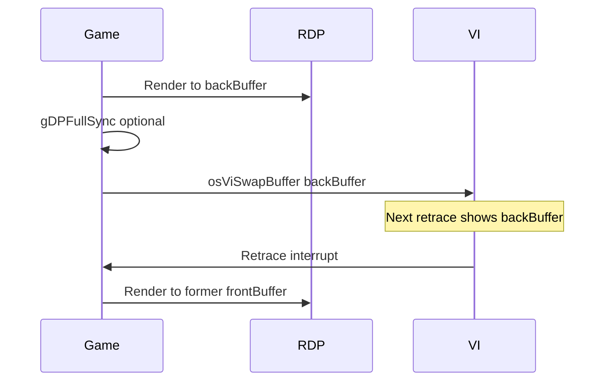

# VI Display Modes

Exhaustive reference for the Video Interface — timing, `OSViMode`, standard presets, special features, and Mario Party 2's embedded mode table.

## VI Role

The **Video Interface** is not a GPU. It:

1. **DMA-reads** a color framebuffer from RDRAM each scanline
2. Converts digital pixels to **analog composite/S-Video/RGB** (via DAC chip)
3. Generates **horizontal and vertical sync** for the display
4. Fires **retrace interrupts** at field boundaries (~60 Hz NTSC)

The RDP writes pixels; the VI displays them. No rendering happens in the VI.

## Timing Fundamentals

### NTSC (North America, Japan)

| Parameter | Value |
|-----------|-------|
| Field rate | ~59.94 Hz |
| Lines per field | 262.5 (interlaced) or 262 (progressive) |
| Active lines (approx) | 240 per field in lo-res progressive |
| Color subcarrier | 3.579545 MHz |

### PAL (Europe)

| Parameter | Value |
|-----------|-------|
| Field rate | 50 Hz |
| Lines per field | 312 |
| Active lines | 288 interlaced / 240 progressive variants |

### MPAL (Brazil)

50 Hz-ish timing variant; separate mode table entries in libultra.

### Field vs frame

| Term | Meaning |
|------|---------|
| **Field** | One vertical sweep (odd or even lines) |
| **Frame** | Two fields (interlaced) or one field (progressive lo-res) |

**Interlaced 640×480**: Each field draws 240 lines; combined image is 480 lines tall but **only half updates per field** → visible flicker on thin horizontal details.

**Progressive 320×240** (`LF` modes): One field = one full frame. **Most N64 games** use this for stable 60 Hz gameplay.

## OSViMode Structure

Public libultra layout (~48 bytes core; MP2 uses **80-byte padded entries**):

| Offset | Field | Role |
|--------|-------|------|
| `0x00` | `type` | Mode type index (see table below) |
| `0x01` | `unk` | Reserved |
| `0x02` | `is32` | 32-bit color flag |
| `0x03` | `pad` | Alignment |
| `0x04` | `comRegs` | Composite timing (`width`, `burst`, `vSync`, `hSync`, `leap`, …) |
| `0x1C` | `fldRegs[0]` | Field 0: origin, scale, vStart/vEnd, vBurst, width |
| `0x2C` | `fldRegs[1]` | Field 1 (interlace second field) |

Fixed-point scales **`xScale`** / **`yScale`** (applied via `osViSetXScale` / `osViSetYScale`) adjust aspect ratio independently of mode struct.

### Key comRegs / fldRegs semantics

| Register | Role |
|----------|------|
| `width` | Half-line sample count (related to horizontal resolution) |
| `fldRegs[].width` | Pixels per scanline (e.g. 640, 320) |
| `fldRegs[].origin` | RDRAM framebuffer byte offset for field start |
| `fldRegs[].yScale` | Vertical scale (fixed point) |
| `vStart` / `vEnd` | Active video line range |
| `vBurst` | Color burst placement |

## Standard libultra Mode Presets

### NTSC modes (naming: `[Region][Scan][Resolution][Field]`)

| Symbol | Resolution | Scan | Description |
|--------|------------|------|-------------|
| `osViModeNtscLan1` | 640×480 | Interlaced | **Lo-res interleaved hi** — sharp menus |
| `osViModeNtscHan1` | 640×240 | Interlaced | Half vertical |
| `osViModeNtscHpf1` | 640×240 | Progressive | Half frame progressive |
| `osViModeNtscHbn1` | 640×240 | Interlaced | Half bottom |
| `osViModeNtscHaf1` | 640×240 | Interlaced | Half alternate |
| **`osViModeNtscLf1`** | **320×240** | **Progressive** | **Most common game mode** |
| `osViModeNtscLf2` | 320×240 | Progressive | Variant timing |
| `osViModeNtscHf1` | 640×240 | Progressive | Wide progressive |
| `osViModeNtscHf2` | 640×240 | Progressive | Variant |
| `osViModeNtscMpf1` | 320×480 | Interlaced | Med-res interlaced |
| `osViModeNtscMpf2` | 320×480 | Interlaced | Variant |
| `osViModeNtscLpf1` | 320×240 | Interlaced | Low progressive-interlace |
| `osViModeNtscLpf2` | 320×240 | Interlaced | Variant |
| `osViModeNtscLpn1` | 320×240 | Interlaced | Low interlace |
| `osViModeNtscLpn2` | 320×240 | Interlaced | Variant |

### PAL equivalents

| Symbol | Notes |
|--------|-------|
| `osViModePalLan1` | 640×480 interlaced |
| `osViModePalLf1` | 320×240 progressive |
| `osViModePalMpf1` | 320×480 interlaced |
| … | Full set mirrors NTSC with PAL timing |

### When to use which mode

| Use case | Recommended mode |
|----------|------------------|
| Gameplay (3D/2D) | **320×240 progressive (`Lf1`)** |
| High-res static screens | 640×480 interlaced (`Lan1`) |
| Minimal RDRAM bandwidth | 320×240 progressive |
| Maximum vertical detail | 640×480 interlaced (30 Hz effective full frame) |

## Mode Selection API

| Function | VRAM (MP2) | Role |
|----------|------------|------|
| `osTvType` | — | Returns `OS_TV_NTSC`, `OS_TV_PAL`, `OS_TV_MPAL` |
| `osViSetMode` | `0x800A6E50` | Install `OSViMode*` into VI hardware |
| `osViSetYScale` | `0x800A7010` | Vertical scale (MP2 init: **1.0f** @ `0x8007E328`) |
| `osViSetXScale` | libultra | Horizontal scale |
| `osViBlack` | `0x800A73C0` | Blank display (fade/overlay loads) |
| `osViSwapBuffer` | `0x800A7060` | Point VI at completed framebuffer |
| `osViSetEvent` | `0x800A6DF0` | Retrace → `OSMesgQueue` |
| `osViGetCurrentFramebuffer` | `0x800A6A30` | Query displayed buffer |
| `osViSetSpecialFeatures` | `0x800A6EA0` | Gamma, dither, divot, AA |

### osTvType detection

MP2 calls **`func_800A6AB0`** (likely `osTvType` wrapper) with sentinel **`0xFE`** before mode selection @ `0x8007E300`, then indexes the mode table by `(modeIndex × 80) + D_800CDF10`.

## osViSetSpecialFeatures Flags

Public libultra constants (single feature per call — OR'd into internal state):

| Constant | Value | Effect |
|----------|-------|--------|
| `OS_VI_GAMMA_ON` | 1 | Enable gamma correction |
| `OS_VI_GAMMA_OFF` | 2 | Disable gamma correction |
| `OS_VI_GAMMA_DITHER_ON` | 4 | Gamma dither on |
| `OS_VI_GAMMA_DITHER_OFF` | 8 | Gamma dither off |
| `OS_VI_DIVOT_ON` | 16 | Divot filter on (fills single-pixel holes) |
| `OS_VI_DIVOT_OFF` | 32 | Divot off |
| `OS_VI_DITHER_FILTER_ON` | 64 | VI dither filter on |
| `OS_VI_DITHER_FILTER_OFF` | 128 | Dither filter off |

### MP2 boot call

[`asm/1060.s`](../../asm/1060.s) @ **`0x80040B50`**:

```mips
jal   osViSetSpecialFeatures
addiu $a0, $zero, 0x2    # OS_VI_GAMMA_OFF
```

MP2 **disables VI gamma correction** at early init — linear framebuffer values map directly to DAC without gamma curve remapping.

## Double Buffering and Swap



Rules:

- Buffer pointer **8-byte aligned**
- Do not read-modify-write the buffer VI is scanning (use double buffer)
- `osViSwapBuffer` during active scan may tear — swap at retrace boundary when possible

## Anti-Aliasing Stack

Three distinct layers — do not conflate:

| Layer | Mechanism |
|-------|-----------|
| **RDP coverage AA** | Subpixel coverage in blender (`G_RM_AA_*` render modes) |
| **RDP point sampling** | Without AA modes, textures alias |
| **VI divot / dither** | Post-filter on output (`OS_VI_DIVOT_*`, dither flags) |
| **Interlace flicker** | Temporal artifact of 640×480i, not AA |

MP2 uses standard RDP AA render modes for 3D; VI gamma is off; divot/dither defaults from libultra.

## Safe Area and Overscan

CRT TVs crop **5–10%** of the framebuffer edge. MP2 UI keeps critical elements inset. Scissor can clip RDP draws but does not change VI scan width — black borders may appear on modern flat panels with 4:3 stretch.

`osViSetYScale(1.0f)` in MP2 init preserves default vertical aspect; widescreen hacks would use ≠ 1.0.

## Retrace and Game Loops


MP2 engine **`SleepVProcess`** (`0x8007DA44`) aligns HuPrc processes to vertical retrace rather than polling SI/VI directly.

VI event registration @ `0x8007E28C`: **`osSetEventMesg(14, queue, msg)`** — event type 14 = **`OS_EVENT_VI`**.

## MP2 Embedded Mode Table

VRAM base **`D_800CDF10`** @ `0x800CDF10`:

- **Stride:** 80 bytes (`modeIndex × 0x50 + base`)
- **Selector:** `func_8007E2A0` — stores mode index, calls `osViSetMode`, `osViSetYScale(1.0f)`, `osViBlack(1)`, sets up RCP mesg queues

Auto-generated dump: **[mp2-vi-mode-table.md](mp2-vi-mode-table.md)** (from `tools/dump_vi_modes.py`).

| Index | Type byte | Likely libultra equivalent |
|-------|-----------|----------------------------|
| 0 | 0 | NTSC mode set 0 (LAN/FP family) |
| 1 | 1 | LAN1 — 640×480 interlaced |
| 2 | 2 | **LF1 — 320×240 progressive** |
| 3 | 3 | MF1 — 320×480 interlaced |
| 4 | 4 | HF1 — 640×240 progressive |
| 5 | 5 | LP1 |
| 6 | 6 | HP1 |
| 7 | 7 | MP1 |
| 8+ | 8+ | Extended / MPAL / debug variants |

Fld width **640** in table entries corresponds to half-line sample count for 320-pixel logical width (×2 for RGBA5551 fetch).

## Init Sequence (MP2)

From [`asm/1060.s`](../../asm/1060.s) `func_8007E2A0`:

1. Clear framebuffer / RCP globals (`D_800EB910`, `D_800ECAD0`, …)
2. Detect TV type (`func_800A6AB0`)
3. **`osViSetMode(&D_800CDF10[index × 0x50])`**
4. **`osViSetYScale(1.0f)`**
5. **`osViBlack(TRUE)`** — hide garbage during buffer setup
6. Create mesg queues for RCP @ `D_800EB950`
7. **`osSetEventMesg(OS_EVENT_VI, …)`** @ `func_8007E260`
8. Spawn RCP thread @ `func_8007E754`

Early boot @ `0x80040B50` separately calls **`osViSetSpecialFeatures(OS_VI_GAMMA_OFF)`**.

## Related Docs

- [07-graphics-pipeline-overview.md](07-graphics-pipeline-overview.md) — Frame timeline
- [09-rdp-framebuffers-pixel-formats.md](09-rdp-framebuffers-pixel-formats.md) — Buffer format VI reads
- [05-video-and-audio-io.md](05-video-and-audio-io.md) — Shorter VI summary
- [mp2-vi-mode-table.md](mp2-vi-mode-table.md) — Raw mode table dump
