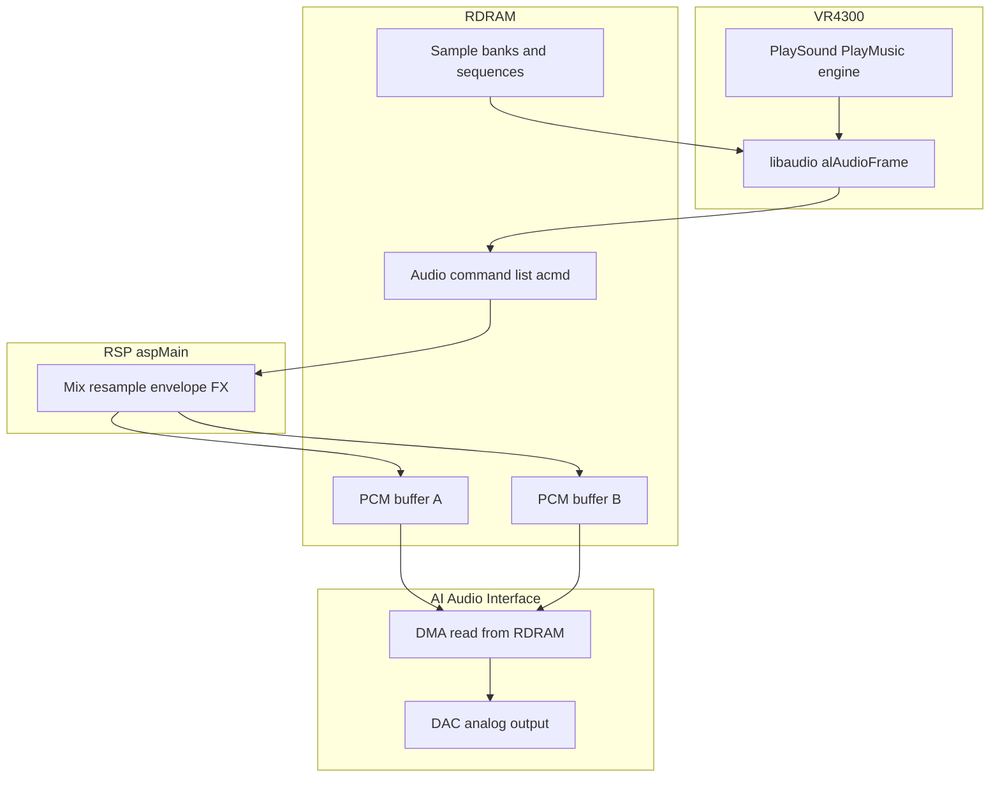
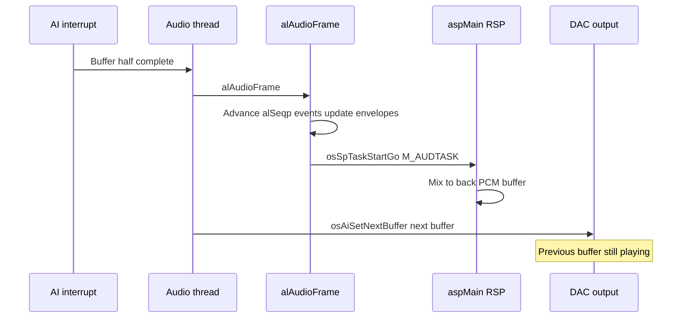

# N64 Audio Pipeline Overview

How Mario Party 2 produces sound — from ROM sequences and sample banks through libaudio, RSP aspMain, and the AI DAC.

## Core Principles

### Unified RDRAM (no audio RAM)

Like graphics, the N64 has **no dedicated audio memory**. Sample banks, sequence data, audio command lists, and PCM output buffers all live in **RDRAM** alongside game code and framebuffers.

### Split architecture: CPU libaudio → RSP → AI

| Stage | Processor | Role |
|-------|-----------|------|
| Game + libaudio | VR4300 | Play requests, sequence events, build acmd list |
| aspMain | RSP | Mix voices, resample, apply FX, write PCM |
| AI | Fixed hardware | DMA PCM from RDRAM to DAC |

This mirrors the graphics path (CPU → GBI → RSP F3DEX → RDP → VI) but with **libaudio** instead of GBI and **aspMain** instead of F3DEX.

### Double-buffered PCM output

The AI reads one PCM buffer while aspMain fills the next. **`osAiSetNextBuffer`** queues the next region; when the current DMA completes, the AI interrupt fires and libultra swaps buffers.

### Sample rate

Games typically configure **22050 Hz** or **44100 Hz** via **`osAiSetFrequency`**. MP2 uses the standard libultra audio driver defaults set at init.

### Timing: AI interrupt, not VI retrace

Audio is driven by **AI DMA completion**, not vertical retrace. **`alAudioFrame`** runs on the audio thread each tick (~60 Hz or per buffer boundary) to advance sequences and submit RSP work.

## Full Pipeline

## Data Flow Summary

| Stage | Input | Output |
|-------|-------|--------|
| Engine | Sound/music index | Calls to `alSndp*` / `alSeqp*` |
| libaudio | Bank/seq data, voice state | acmd list in RDRAM |
| aspMain (RSP) | acmd list | 16-bit PCM in output buffer |
| AI | PCM buffer pointer | Analog audio to TV/speakers |

## MP2 Audio Layers

| Layer | Engine API | libaudio API | Content |
|-------|------------|--------------|---------|
| **Background music** | `func_8000F744` (PlayMusic candidate) | `alSeqpPlay`, `alSeqpSetSeq`, `alSeqpSetVol` | MIDI-like `.seq` files |
| **Sound effects** | `PlaySound(index)` | `alSndpAllocate`, `alSndpPlay`, `alSndpSetSound` | Indexed SFX from sample bank |
| **Character voices** | `PlayCharacterSound(idx, char)` | Same as SFX + overlap guard | Per-character voice lines |

All three layers share the **`alSyn`** synthesizer voice pool and mix through the same aspMain path.

## Per-Tick Timeline

## RSP Sharing with Graphics

MP2 uses the **same RSP** for F3DEX2 (graphics) and aspMain (audio). Tasks cannot run concurrently — **`osSpTaskStartGo`** / **`osSpTaskYield`** serialize access (see [08-gbi-rsp-microcode.md](08-gbi-rsp-microcode.md)). Graphics RCP thread @ `0x8007E754` and audio init @ `func_8001679C` must coordinate through libultra scheduling.

## Cache Coherency

Same rule as graphics: CPU-written acmd lists and sample data must be **writeback-visible** to RSP before `osSpTaskStartGo`. libaudio handles this internally; engine code that patches audio buffers directly must call `osWritebackDCache`.

## Audio Doc Index

| Doc | Topic |
|-----|-------|
| [12-ai-hardware-and-aspMain.md](12-ai-hardware-and-aspMain.md) | AI DMA, PCM buffers, aspMain ucode |
| [13-libaudio-library.md](13-libaudio-library.md) | alSyn, alSeqp, alSndp, processing graph |
| [14-mp2-audio-engine-and-assets.md](14-mp2-audio-engine-and-assets.md) | PlaySound path, music, ROM assets |
| [05-video-and-audio-io.md](05-video-and-audio-io.md) | Short AI summary |
| [../09-audio.md](../09-audio.md) | Engine-level API |
| [audio-call-inventory.md](audio-call-inventory.md) | libaudio call counts (auto-generated) |
