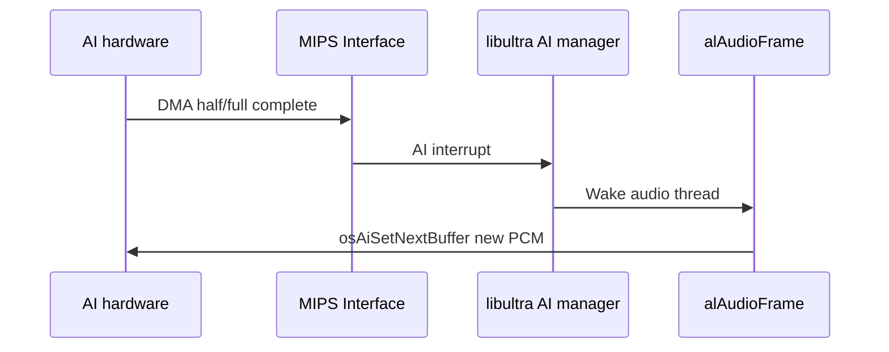

# AI Hardware and aspMain

The Audio Interface (AI) streams PCM to the DAC; the RSP **aspMain** microcode mixes samples into those PCM buffers.

## AI (Audio Interface)

### Register block

KSEG1 base **`0xA4500000`**. libultra wraps raw register access — MP2 does not poke AI registers directly from game code.

| Register (conceptual) | Role |
|-----------------------|------|
| DMA address | RDRAM source pointer for current PCM transfer |
| DMA length | Bytes remaining / buffer size |
| Control | Start/stop DMA |
| Status | Busy flag, interrupt pending |

### libultra AI API

| Function | VRAM (MP2) | Role |
|----------|------------|------|
| `osAiSetFrequency(hz)` | libultra | Set DAC sample rate (22050 / 44100 / 48000) |
| `osAiSetNextBuffer(vaddr, nbytes)` | libultra | Queue next PCM buffer (8-byte aligned) |
| `osAiGetLength` | `0x8009E2D0` | Bytes remaining in current DMA |
| `osAiDeviceBusy` | `0x800A86B0` | Poll before reprogramming DMA |

MP2 polls **`osAiGetLength`** @ [`0x80016364`](../../asm/1060.s) in the audio driver loop.

### AI interrupt flow



Unlike VI retrace, AI interrupts are tied to **audio buffer boundaries**, not display refresh.

## PCM Buffer Strategy

### Buffer size

```
bytesPerBuffer = (sampleRate / updateRate) × bytesPerSample × channels
```

For 44100 Hz, ~60 updates/sec, 16-bit stereo:

```
44100 / 60 × 2 × 2 ≈ 2940 bytes per buffer
```

libultra pre-allocates a pair (or triple) of buffers in RDRAM at audio init.

### Double buffering

| Buffer | State |
|--------|-------|
| **Playing** | AI DMA reading now |
| **Filling** | aspMain writing via RSP task |

Underrun (AI catches up to empty buffer) produces clicks/pops — `alAudioFrame` must keep pace.

### Sample format

aspMain output is typically **16-bit PCM** (mono or interleaved stereo). Final format matches `osAiSetFrequency` and DAC expectations.

## aspMain RSP Microcode

### Location in MP2

| Symbol | VRAM | ROM |
|--------|------|-----|
| `aspMainDataStart` | `0x800BE960` | `0xBF560` |
| `aspMainTextStart` | `0x800BEC20` | `0xBF820` |

Embedded in main segment ROM — same pattern as F3DEX2 fifo data for graphics.

### M_AUDTASK (OSTask type 2)

Audio init @ **`func_8001679C`** [`asm/1060.s`](../../asm/1060.s) ~`0x8001679C` builds an `OSTask`:

| OSTask field | MP2 value (from asm) |
|--------------|----------------------|
| `type` | `M_AUDTASK` (2) |
| `flags` | 2 |
| `ucode_data` | `aspMainDataStart` @ `0x800BE960` |
| `data_ptr` | Audio heap / buffer @ `0x800D1480` |
| `data_size` | `0x800` |
| Yield / mesg ptrs | `D_800D7B08` region |

Parallel to graphics `M_GFXTASK` setup with `gspF3DEX2_fifoDataStart`.

### acmd (audio command) list

Like GBI **`Gfx`** words for graphics, libaudio builds **acmd** structures in RDRAM:

- Sample pointer, pitch, volume, pan
- Envelope state
- Mix bus routing
- Terminator / sync commands

aspMain parses acmd entries and writes mixed PCM to the output buffer.

### aspMain processing steps

1. Fetch acmd from RDRAM
2. For each active voice: decode ADPCM/PCM sample (or receive pre-decoded data)
3. Apply envelope (ADSR)
4. Resample to output rate
5. Pan and accumulate to main/aux buses
6. Apply FX (reverb) if enabled
7. Write 16-bit PCM to output buffer

## RSP Scheduling vs Graphics

Both aspMain and F3DEX2 use **`osSpTaskStartGo`**. MP2 cannot run both simultaneously.

| Task | Ucode | Trigger |
|------|-------|---------|
| Graphics | F3DEX2 / GS2DEX2 | RCP thread @ `0x8007E754` |
| Audio | aspMain | `alAudioFrame` on audio thread |

libultra **`osSpTaskYield`** allows cooperative handoff if a task is still running when the other submits.

## MP2 Evidence

- **OSTask build:** `func_8001679C` @ `0x8001679C` — stores `aspMainDataStart` in task @ offset `0x10`
- **AI poll:** `osAiGetLength` @ `0x80016364`
- **aspMain blob:** [`aspMainDataStart`](../../asm/1060.s) rodata section ~line 215119

## Related Docs

- [11-audio-pipeline-overview.md](11-audio-pipeline-overview.md) — End-to-end flow
- [13-libaudio-library.md](13-libaudio-library.md) — What builds the acmd list
- [08-gbi-rsp-microcode.md](08-gbi-rsp-microcode.md) — Shared OSTask machinery
- [05-video-and-audio-io.md](05-video-and-audio-io.md) — Short AI summary
