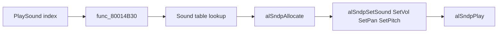

# MP2 Audio Engine and Assets

How Mario Party 2's Hudson engine wraps libaudio — `PlaySound`, music control, character voices, and ROM asset layout.

## Engine API Map

| Function | VRAM | libaudio / internal path |
|----------|------|--------------------------|
| **`PlaySound(index)`** | `0x80014B14` | → `func_80014B30` → `alSndp*` |
| **`PlayCharacterSound(idx, char)`** | `0x8007975C` | Overlap guard → `PlaySound` variant |
| **`func_8000ECB8`** | `0x8000ECB8` | Music track switch → `alSeqpSetSeq/Play` |
| **`func_8000F744`** | `0x8000F744` | Calls `func_8000ECB8` — **PlayMusic candidate** |
| **`func_8000EDA4`** | `0x8000EDA4` | Set sequence from table → `alSeqpSetSeq` |
| Fade / volume | `0x8000EE1C`+ | `alSeqpSetVol`, `alSeqpStop` |
| Tempo control | `0x80011414` | `alSeqpSetTempo` |

`PlayMusic` is not yet named in [`symbol_addrs.txt`](../../symbol_addrs.txt); disassembly points to **`func_8000F744`** as the primary music entry.

## PlaySound Path

From [`asm/1060.s`](../../asm/1060.s) @ **`0x80014B14`**:

1. **`PlaySound`** — thin wrapper calling `func_80014B30(index, 0)`
2. **`func_80014B30`** — loads sound bank object, bounds-checks index against table count
3. Reads per-sound entry: sample ID, priority, pan, pitch, volume
4. **`alSndpAllocate`** — get sound handle
5. **`alSndpSetSound`** — bind bank sample
6. Parameter setters → **`alSndpPlay`**

Sound bank pointer lives near **`D_800D58E4`** (cleared on certain sound resets @ `0x80014B08`).

## Music / Sequence System

### Global state

| Symbol | VRAM | Role |
|--------|------|------|
| **`D_800D58D8`** | `0x800D58D8` | Pointer to seq-player control struct |
| Seq player object | via `D_800D58D8` | Holds `alSeqp*` handle, current track |

### Track change (`func_8000ECB8`)

1. Compare requested track index vs current (`lbu 0x2D`)
2. If changed: look up sequence pointer from track table
3. **`alSeqpSetSeq`** with new sequence
4. Optional volume fade via **`alSeqpSetVol`**

### PlayMusic candidate (`func_8000F744`)

Calls **`func_8000ECB8`** with track index — entry point for board/minigame music changes before overlay loads.

### Fade / stop cluster

Heavy **`alSeqpSetVol`** / **`alSeqpStop`** usage @ `0x8000EF00`–`0x80010550`:

- Gradual volume ramps (fade in/out)
- Hard stop before track swap
- **`alSeqpDelete`** @ `0x800100C8` on shutdown

## PlayCharacterSound

| VRAM | `0x8007975C` |
|------|--------------|

**Rule:** Same character's voice lines do not overlap — if Mario is mid-line, a new Mario line waits or replaces per engine policy.

Implementation walks character voice slots before calling into the shared SFX path. Important for board dialog and minigame callouts where multiple players could trigger voices simultaneously.

Also calls **`PlaySound`** @ `0x800795B4` / `0x80079738` for the actual playback after slot assignment.

## Direct Synth Path

Some engine code bypasses `alSndp` and calls **`alSyn*`** directly @ `0x8007EFD8`:

- `alSynAddPlayer`
- `alSynAllocVoice` / `alSynStartVoice`
- `alSynSetPan/Vol/Pitch/FXMix`

Used for engine-managed voices (possibly streaming or special board audio).

## Audio Init Sequence

Boot path (from disassembly evidence):

1. **Audio heap** — `alHeapInit` on region @ `D_800D7B08`
2. **Load bank/seq** — `alBnkfNew`, `alSeqFileNew` from ROM pointers
3. **`alSynNew`** @ `0x800A1244` — create synthesizer
4. **`alSeqpNew`** / **`alCSPNew`** — create players
5. **`alSynAddPlayer`** — wire players to synth
6. **Build graph** — `alMainBusNew`, `alEnvmixerNew`, `alFxNew`, etc.
7. **`func_8001679C`** — fill **`M_AUDTASK`** with `aspMainDataStart`
8. **AI setup** — frequency + initial PCM buffers
9. **Audio thread** — runs `alAudioFrame` loop

OSTask construction mirrors graphics init but uses **`aspMainDataStart`** instead of F3DEX2.

## ROM Asset Layout

| Region | Content |
|--------|---------|
| ROM `0x418A50`+ | Asset tail — banks, sequences, samples |
| MainFS | Some audio loaded on demand via **`ReadMainFS`** |
| Main segment | Pointer tables to resident banks/seqs |

### File types

| Extension | libaudio API | Contents |
|-----------|--------------|----------|
| `.bank` / `.tbl` | `alBnkfNew` | Instruments + ADPCM samples |
| `.seq` | `alSeqFileNew` | MIDI-like music tracks |

See [../11-asset-formats.md](../11-asset-formats.md) for MainFS; bank/seq binary layout is libaudio format (instrument headers, sample offsets, ADPCM books).

### Overlay binding

Minigame overlays embed **sound index constants** in `.data` — they call main-segment **`PlaySound`** rather than linking libaudio directly.

## Audio vs Graphics RSP Contention

| Subsystem | RSP ucode | Submit path |
|-----------|-----------|-------------|
| Graphics | F3DEX2 / GS2DEX2 | RCP thread `0x8007E754` |
| Audio | aspMain | `alAudioFrame` |

Both use **`osSpTaskStartGo`**. libultra serializes via SP status + yield. MP2 must complete or yield one task before starting the other — collision causes silent audio or corrupt frames.

## Naming TODO (decomp)

| Current label | Suggested name |
|---------------|----------------|
| `func_8000F744` | `PlayMusic` |
| `func_8000ECB8` | `SetMusicTrack` or `ChangeMusic` |
| `func_80014B30` | `PlaySoundImpl` |
| `func_8001679C` | `BuildAudioTask` |

## Related Docs

- [11-audio-pipeline-overview.md](11-audio-pipeline-overview.md) — Pipeline overview
- [13-libaudio-library.md](13-libaudio-library.md) — libaudio API reference
- [../09-audio.md](../09-audio.md) — Short engine summary
- [audio-call-inventory.md](audio-call-inventory.md) — Call-site counts
