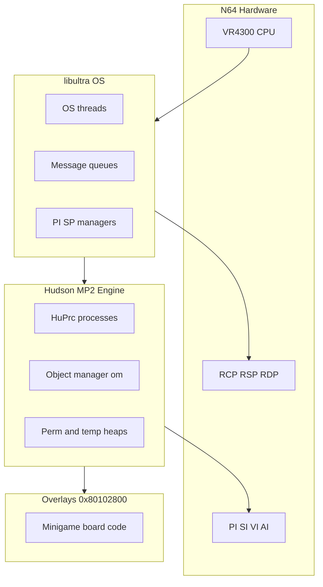
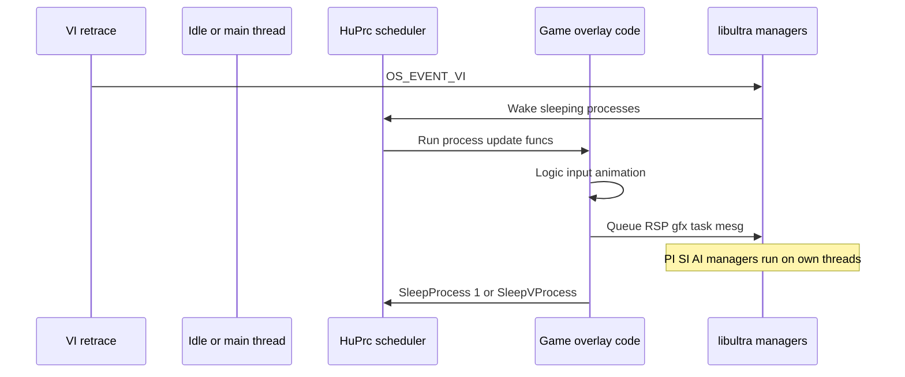

# CPU Software Stack Overview

What the VR4300 runs directly in Mario Party 2 — game logic, libultra OS, Hudson engine, and how that relates to RCP offload.

## CPU vs RCP Division

| Runs on VR4300 (CPU-driven) | Runs on RCP (coprocessor) |
|-----------------------------|----------------------------|
| Game rules, board logic, minigame scripts | F3DEX2 / GS2DEX2 graphics ucode |
| HuPrc cooperative processes | aspMain audio ucode |
| libultra OS threads and managers | RDP pixel fill |
| Display list **construction** | Display list **execution** |
| HVQ decompression, MainFS reads | ADPCM decode in audio graph (CPU builds acmd; RSP mixes) |
| Overlay dispatch, heap alloc | PI DMA hardware (CPU submits requests) |
| Controller poll, EEPROM I/O setup | SI/PI/AI/VI hardware (CPU via libultra) |

The CPU is the **orchestrator**. RCP blocks accelerate rendering and audio mixing but do not run gameplay C code.

## Software Layers

| Layer | Location | Examples |
|-------|----------|----------|
| libultra | Main @ `0x8009C000`+ | `osCreateThread`, `osRecvMesg`, `osEPiStartDma` |
| Engine | Main @ `0x80000460`+ | `InitProcess`, `PlaySound`, `omOvlCallEx` |
| Overlay | `0x80102800` window | Per-minigame update loops |
| libaudio | Main (linked) | `alAudioFrame`, `alSeqpPlay` — CPU-side sequencing |

## Main Segment Boot (CPU Path)

From [`asm/1060.s`](../../asm/1060.s) @ **`0x80000460`**:

1. **`func_800A7D40`** — `osInitialize` equivalent
2. **`func_8007E260`** — VI event registration
3. **`osCreateThread`** / **`osStartThread`** — idle + main OS threads @ `D_800D53F0`
4. Engine init — heaps, `InitObjSys`, audio/graph init
5. First **`omOvlCallEx`** — jump to title overlay

Entry BSS clear and stack setup happen in [`entrypoint.s`](../../asm/entrypoint.s) before main.

## One Frame: CPU Work

CPU-heavy stretches: **HVQ decompress**, **overlay PI DMA wait**, **EEPROM read/write**, large **`ReadMainFS`**.

## Three Scheduling Models on One CPU

| Model | Mechanism | MP2 use |
|-------|-----------|---------|
| **Preemptive OS threads** | Exception + libultra scheduler | VI/PI/SI/AI/RCP managers |
| **Cooperative HuPrc** | `setjmp`/`longjmp` | Board objects, minigame logic |
| **Synchronous calls** | Plain `jal`/`jr` | Init, one-shot helpers |

Only one VR4300 executes at a time — "parallelism" is **interrupt-driven preemption** of OS threads while HuPrc processes voluntarily yield.

## Compiler and ABI

| Setting | Value |
|---------|-------|
| Compiler | GCC 2.7.2 (`tools/gcc_2.7.2/`) |
| Flags | `-mips3 -mgp32 -mfp32 -O1 -G0` |
| GP-relative data | Small data via `$gp` |
| Float | COP1 FPU, `f32` in structs |

See [01-vr4300-cpu.md](01-vr4300-cpu.md) for MIPS registers and delay slots.

## CPU Doc Index

| Doc | Topic |
|-----|-------|
| [16-libultra-os-threads-messaging.md](16-libultra-os-threads-messaging.md) | OS threads, mesg queues, timers |
| [17-memory-heaps-dma-coherency.md](17-memory-heaps-dma-coherency.md) | Heaps, PI DMA, cache, TLB |
| [18-mp2-cpu-engine-scheduling.md](18-mp2-cpu-engine-scheduling.md) | HuPrc, om overlays, MainFS |
| [01-vr4300-cpu.md](01-vr4300-cpu.md) | VR4300 silicon summary |
| [cpu-call-inventory.md](cpu-call-inventory.md) | libultra/engine call counts |
