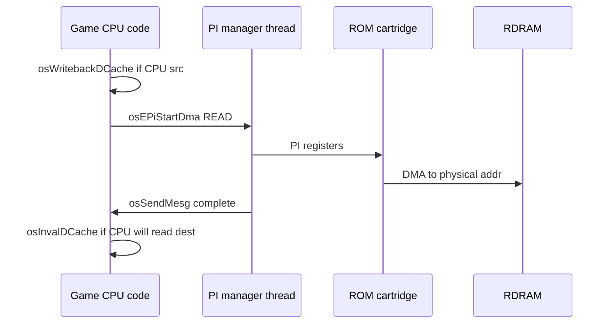

# Memory, Heaps, DMA, and Cache Coherency

CPU-side memory management in Mario Party 2: virtual/physical translation, heap allocators, PI DMA rules, and cache maintenance before RCP or PI reads CPU-written buffers.

## Address Spaces (CPU View)

| Range | Segment | Use |
|-------|---------|-----|
| `0x80000000`–`0x803FFFFF` | KSEG0 cached | Main code, data, heaps |
| `0xA0000000`–`0xA003FFFF` | KSEG1 uncached | Hardware registers, boot |
| `0x80100000`–`0x801FFFFF` | KSEG0 | RDRAM framebuffers, Z, audio buffers |
| `0x80102800`+ | KSEG0 | **Overlay text window** (115 modules) |

Full map: [02-memory-map.md](02-memory-map.md) and engine [01-memory-map.md](../01-memory-map.md).

## Virtual → Physical

| API | VRAM | Calls (main) |
|-----|------|--------------|
| `osVirtualToPhysical` | `0x800A2470` | ~46 |

Required whenever passing a CPU pointer to:

- **`osEPiStartDma`** (cart DMA)
- **`osPiStartDma`**
- RSP **`OSTask`** fields (ucode, DL, yield buffer)
- AI DMA source pointers

Implementation walks TLB entries or uses direct-map for KSEG0 (`virt & 0x1FFFFFFF`).

## Cache Operations

VR4300 has **split I/D caches** (16 KiB each, 32-byte lines). CPU must maintain coherency when:

| Scenario | Required op |
|----------|-------------|
| CPU wrote buffer → PI DMA read | `osWritebackDCache` / `osWritebackDCacheAll` |
| PI DMA wrote → CPU reads | `osInvalDCache` |
| CPU wrote ucode/DL → RSP reads | Writeback D-cache on buffer range |
| Self-modifying code (overlays) | `osInvalICache` on new text |

Common libultra symbols (MP2 main segment):

| Function | Typical use |
|----------|-------------|
| `osInvalDCache` | Post-DMA invalidate |
| `osWritebackDCache` | Pre-DMA writeback |
| `osInvalICache` | After overlay load to `0x80102800` |

Cache op stubs appear inline in [`asm/1060.s`](../../asm/1060.s) as **`cache`** instructions in libultra and overlay loaders.

## PI DMA Flow (CPU Initiated)

**Overlay load** (`omOvlCallEx`): READ from ROM `romStart` → **`0x80102800`**, then **`osInvalICache`** on loaded range before calling entrypoint.

## Heap System

MP2 uses Hudson-style **intrusive linked-list heaps** with two persistent arenas:

| API | VRAM | Role |
|-----|------|------|
| `MakeHeap` | `0x80068460` | Initialize heap header at `addr` |
| `Malloc` | `0x80068480` | Allocate from heap |
| `Free` | `0x800684A0` | Return block |
| `MakePermHeap` | `0x80040D80` | Set global perm arena |
| `MallocPerm` | `0x80040DA4` | Alloc from perm |
| `MakeTempHeap` | `0x80040E50` | Set global temp arena |
| `MallocTemp` | `0x80040E74` | Alloc from temp |

Globals:

| Symbol | VRAM |
|--------|------|
| `permHeapPtr` | `0x800DEFD0` |
| `tempHeapPtr` | `0x800DEFD4` |

Wrappers in [`src/41980.c`](../../src/41980.c); allocator core in [`src/68460.c`](../../src/68460.c) (nonmatching).

### Heap Usage Pattern

| Heap | Lifetime | Typical allocations |
|------|----------|---------------------|
| **Permanent** | Whole session | Object tables, process structs, long-lived game state |
| **Temporary** | Between overlay transitions | Minigame scratch, decompression buffers, one-shot strings |

**`ReadMainFS`** @ `0x80017680` allocates via **`MallocPerm`** (or temp for streaming) after PI DMA of file bytes from ROM filesystem.

## MainFS and ROM Reads

| API | VRAM | Role |
|-----|------|------|
| `ReadMainFS` | `0x80017680` | Lookup + DMA + alloc file |

Argument **`0xDDDDFFFF`** in comments marks the Hudson file ID packing. High call count in main segment — every asset cluster (audio, gfx, board data) flows through here or overlay-local reads.

See [11-asset-formats.md](../11-asset-formats.md) for on-disk layout.

## Overlay Memory Window

| Symbol | Value |
|--------|-------|
| Overlay text base | `0x80102800` |
| Dispatch table | `0x800CAD90` (ROM `0xC9474`) |
| Max modules | 115 |

Each overlay entry specifies `romStart`, `romEnd`, `vramText`, `vramEnd`. BSS for an overlay must fit below **`vramEnd`**; overlapping loads without unload corrupt neighbors — **`omOvlKill`** clears before next load.

Engine doc: [04-object-manager.md](../04-object-manager.md).

## TLB and `osMapTLB`

Retail MP2 runs mostly with **direct-mapped KSEG0** (TLB entries from boot). Overlays do not remap TLB per module; they rely on fixed **`0x80102800`** window.

`osMapTLB` / `osUnmapTLB` exist in libultra for rare expansion or debug; not central to MP2 overlay swapping.

## Memory Pressure Checklist

When debugging CPU-side crashes:

1. **Overlay BSS overflow** — allocation past `vramEnd`
2. **Use-after-free on temp heap** — overlay return without `FreeTemp`
3. **Stale cache** — missing writeback/invalidate around DMA
4. **Bad physical pointer** — forgot `osVirtualToPhysical`
5. **Perm heap leak** — `ReadMainFS` without matching free on mode exit

## Related Docs

- [01-vr4300-cpu.md](01-vr4300-cpu.md) — caches and TLB hardware
- [03-boot-and-cartridge.md](03-boot-and-cartridge.md) — PI registers
- [18-mp2-cpu-engine-scheduling.md](18-mp2-cpu-engine-scheduling.md) — HuPrc + om
- [cpu-call-inventory.md](cpu-call-inventory.md) — heap/MainFS call counts
