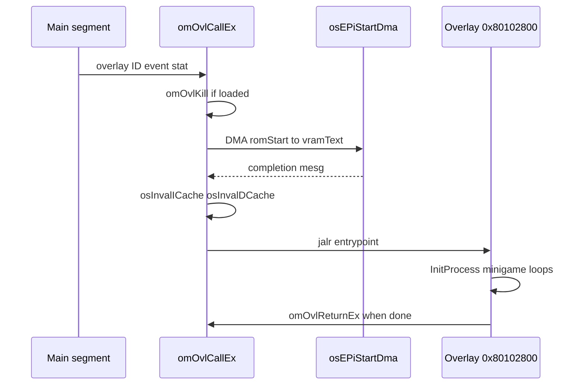

# MP2 CPU Engine — HuPrc, Overlays, and Main Loop

Hudson Soft's cooperative process scheduler, object manager overlay swaps, and how gameplay code shares one VR4300 with libultra managers.

## HuPrc Process System

HuPrc is **not** an OS thread — it is a **cooperative coroutine** layer built on `setjmp`/`longjmp` over fixed process slots.

| API | VRAM | Role |
|-----|------|------|
| `InitProcess` | `0x80076E64` | Register func, priority, stack |
| `SleepProcess` | `0x8007D9E0` | Yield N **frames** |
| `SleepVProcess` | `0x8007DA44` | Yield until VI retrace |
| `WakeUpProcess` | `0x8007DAB0` | Force resume |
| `EndProcess` | `0x8007DB20` | Remove from table |

Process table base: **`D_800CD42C`** (`0x800CD42C`).

Engine guide: [03-process-system.md](../03-process-system.md).

### Process Record (Conceptual)

```c
typedef struct {
    u8  stat;           // RUN / SLEEP / END
    u8  priority;
    u16 sleep;          // frames remaining
    void (*func)(void);
    jmp_buf context;
    // stack pointer, name/debug fields
} Process;
```

### Scheduling Loop

Each "process system tick" (often once per frame):

1. Decrement sleep counters for sleeping processes
2. For each runnable process (priority order):
   - `longjmp` into process `func`
   - Process runs until **`SleepProcess`** / **`SleepVProcess`** / **`EndProcess`**
   - `Sleep*` saves context via `setjmp` and returns to scheduler
3. libultra VI thread may run between HuPrc slices

**No preemption inside HuPrc** — infinite loops freeze the game unless an interrupt-driven subsystem still runs.

## Object Manager (`om`)

Tracks runtime objects and loads **115 overlays** into **`0x80102800`**.

| API | Role |
|-----|------|
| `InitObjSys` @ `0x800760C0` | Object pool |
| `omAddObj` | Bind update func to object |
| `omOvlCallEx` | PI DMA overlay + call entry |
| `omOvlGotoEx` | Push history, load new overlay |
| `omOvlReturnEx` | Pop history, restore overlay |
| `omOvlKill` | Unload current module |

History stack: **`omovlhis[12]`**, index **`omovlhisidx`**.



Stub source: [`src/engine/om.c`](../../src/engine/om.c). Catalog: [12-overlay-catalog.md](../12-overlay-catalog.md).

## Typical Overlay Lifecycle (CPU)

1. **Board overlay** running — processes for players, spaces, events
2. Minigame selected → **`omOvlGotoEx(minigame_id, ...)`**
3. PI DMA minigame code → **`0x80102800`**
4. Entry creates HuPrc processes (update, draw setup, camera)
5. Minigame ends → **`omOvlReturnEx`** → board overlay restored from history or re-DMA'd
6. Temp heap often reset on overlay boundary

## Main Loop Integration

High-level CPU loop (main thread @ **`func_800004C0`** region):

```text
while (game_running) {
    osRecvMesg(vi_queue, ..., BLOCK);   // frame boundary
    HuPrcScheduler();                    // all runnable processes
    BuildDisplayLists();                 // CPU — F3DEX2 commands
    SubmitGfxTask();                     // mesg to SP manager
    alAudioFrame(...);                   // CPU — audio graph
    SubmitAudioTask();
    PollControllers();                   // via SI manager / osCont
}
```

Exact function names split across **`1060.s`** and engine C; the **pattern** is consistent across Hudson N64 titles.

## CPU Workloads by Game Phase

| Phase | Heavy CPU APIs |
|-------|----------------|
| Title / menu | `omOvlCallEx`, `ReadMainFS`, `InitProcess` |
| Board | HuPrc processes, `PlaySound`, dialog |
| Minigame start | PI DMA overlay, cache invalidate, heap temp init |
| Minigame play | Process updates, collision, `SleepProcess(1)` |
| Minigame end | Score upload, `omOvlReturnEx`, temp heap free |
| Save | `osEeprom*` — see [19-input-save-pipeline-overview.md](19-input-save-pipeline-overview.md) |

## Decompression (HVQ)

Still images and some assets use **HVQ** (Hudson vector quantizer) on CPU before upload to RDP textures:

- DMA compressed blob from ROM
- CPU decode to temp buffer
- Writeback + texture load via display list

Symbols vary by overlay; main segment references HVQ tables in asset docs [11-asset-formats.md](../11-asset-formats.md).

## Input Path (CPU)

1. SI manager thread completes **`osContGetReadData`**
2. Message to input queue
3. Board/minigame process reads **`contdata[]`** globals
4. Dead-zone and edge detection in game code

Not polled synchronously in hot loops — event-driven via libultra.

## Debugging CPU Engine Issues

| Symptom | Likely cause |
|---------|--------------|
| Hang on minigame load | PI DMA never completes; overlay entry crash |
| Random overlay crash | I-cache not invalidated after DMA |
| Process never wakes | Wrong sleep count; missing `WakeUpProcess` |
| Memory corruption | Temp heap reuse across overlays |
| Stutter every N frames | Too many HuPrc processes per tick |

## Cross-References

| Doc | Topic |
|-----|-------|
| [15-cpu-software-stack-overview.md](15-cpu-software-stack-overview.md) | Layer diagram |
| [16-libultra-os-threads-messaging.md](16-libultra-os-threads-messaging.md) | OS threads vs HuPrc |
| [17-memory-heaps-dma-coherency.md](17-memory-heaps-dma-coherency.md) | Heaps, MainFS, DMA |
| [03-process-system.md](../03-process-system.md) | HuPrc engine guide |
| [04-object-manager.md](../04-object-manager.md) | Overlay API |
| [cpu-call-inventory.md](cpu-call-inventory.md) | Call frequency table |
