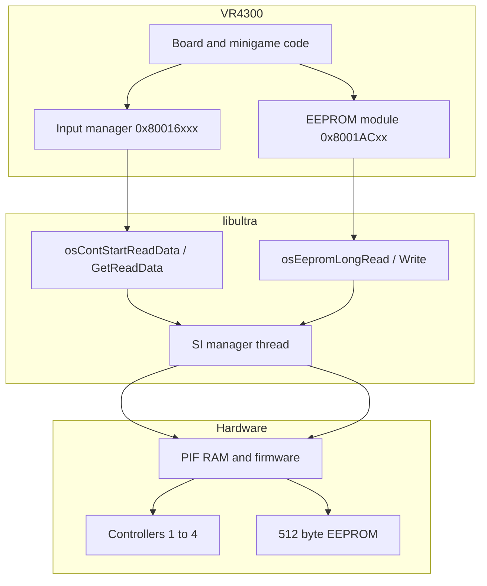

# Input and Save Pipeline Overview

How Mario Party 2 reads controllers and persists party progress — from PIF serial hardware through libultra to Hudson engine globals and EEPROM.

## Two Parallel SI Paths

Both controllers and cartridge EEPROM share the **Serial Interface (SI)** and **PIF** on the N64. MP2 uses them for different purposes:

| Path | Hardware | MP2 use |
|------|----------|---------|
| **Input** | 4 controller ports via PIF | Every frame — buttons, stick, rumble |
| **Save** | 4 Kbit EEPROM in cartridge | Boot, save/load overlay, options |

Neither path touches the VR4300 directly — libultra SI manager performs PIF transactions; game code calls **`osCont*`** or **`osEeprom*`** APIs.

## Software Layers

| Layer | Examples | Doc |
|-------|----------|-----|
| Silicon / bus | SI @ `0xA4800000`, PIF protocol | [06-serial-save-interrupts.md](06-serial-save-interrupts.md) |
| libultra | `osContGetReadData`, `osEepromLongRead` | [20-si-controller-hardware.md](20-si-controller-hardware.md), [21-eeprom-save-hardware.md](21-eeprom-save-hardware.md) |
| MP2 engine | Input manager, EEPROM pack/unpack | [22-mp2-input-save-engine.md](22-mp2-input-save-engine.md) |
| Gameplay | `GwSystem`, `gPlayers`, menus | [../05-game-state.md](../05-game-state.md), [../10-input-and-save.md](../10-input-and-save.md) |

## Controller Input Timeline (One Frame)

1. **Input poll process** (`func_80016BD0` region) blocks on message queue `D_800D81A0`
2. When SI completes, **`osContGetReadData`** fills **`OSContPad`** @ `D_800FA5E0`
3. Per-port data copied into engine buffer **`D_800D8040`** (24 bytes × 4 pads)
4. Minigame/board HuPrc processes read processed buttons from globals or helpers
5. **CPU players** skip hardware via **`PlayerIsCPU`** @ `0x8005DCA0`

Rumble requests go through **`func_80016BBC`** → **`osMotorInit`** / **`osMotorAccess`** when a Controller Pak with rumble is present.

## Save Timeline (Boot or Save Menu)

1. **`osEepromProbe`** — retry until 4 Kbit EEPROM detected (type `0x0080` in high half of return)
2. **`osEepromLongRead`** — DMA entire **512 bytes** into staging **`D_800D89F0`**
3. **Checksum** — byte-sum over range compared to header table **`D_800C9B60`**
4. On match, fields unpacked into **`GW_SYSTEM`** / options structs; on mismatch, factory defaults or repair write
5. **Save** reverses: pack structs → staging → **`osEepromLongWrite`** (504 + 8 byte blocks)

Save/load UI runs in overlay **`ovl_69_SaveLoad`**; core EEPROM logic lives in main segment @ **`0x8001ACD0`**.

## EEPROM vs Controller Pak

| | EEPROM (MP2 primary) | Controller Pak |
|--|---------------------|------------------|
| Location | Inside game cartridge | Plug-in accessory |
| Size | 512 bytes (4 Kbit) | 256 Kbit SRAM |
| libultra API | `osEeprom*` | `osContRamRead/Write`, `osPfs*` |
| MP2 usage | Party records, unlocks | Present in ROM; not primary save |

MP2 ships with EEPROM save — Controller Pak code exists for rumble (`osMotor*`) and libultra completeness.

## Interrupt Role

**`OS_EVENT_SI`** fires when a PIF command completes. libultra SI manager posts to a message queue; MP2 input code **`osRecvMesg`** / **`osSendMesg`** on **`D_800D81A0`** synchronizes poll processes with hardware completion rather than spinning on SI registers.

See [16-libultra-os-threads-messaging.md](16-libultra-os-threads-messaging.md) for the general OS event model.

## Doc Index

| Doc | Topic |
|-----|-------|
| [20-si-controller-hardware.md](20-si-controller-hardware.md) | PIF, `OSContPad`, rumble, Controller Pak |
| [21-eeprom-save-hardware.md](21-eeprom-save-hardware.md) | EEPROM blocks, `osEeprom*` protocol |
| [22-mp2-input-save-engine.md](22-mp2-input-save-engine.md) | MP2 managers, globals, checksum, overlays |
| [input-save-call-inventory.md](input-save-call-inventory.md) | Call counts (auto-generated) |
| [06-serial-save-interrupts.md](06-serial-save-interrupts.md) | SI summary and IRQ table |
