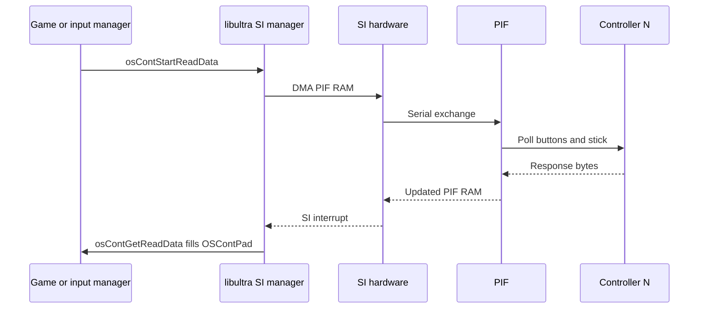

# SI, PIF, and Controller Hardware

Physical controller path on the N64 — Serial Interface registers, PIF firmware, `OSContPad` layout, rumble motor, and optional Controller Pak.

## Serial Interface (SI)

| Register block | KSEG1 address | Role |
|----------------|---------------|------|
| SI DRAM address | `0xA4800000` | RDRAM pointer for PIF RAM exchange |
| SI PIF RAM | `0xA480000C` | 64-byte PIF buffer (command/response) |

The VR4300 never talks to controllers directly. libultra writes a **PIF command list** into RDRAM, points SI at it, and waits for **`OS_EVENT_SI`**.

## libultra Controller API

| Function | VRAM | Calls (main) | Role |
|----------|------|--------------|------|
| `func_800A2100` | `0x800A2100` | 1 | Controller init (wraps detection) |
| `osContStartReadData` | `0x800A1FBC` | 0 | Queue pad poll (via input manager) |
| `osContGetReadData` | `0x800A1F20` | 1 | Copy results to caller buffer |
| `osMotorInit` | `0x800A7420` | 6 | Detect rumble pak |
| `osMotorAccess` | `0x800A7668` | — | Start/stop rumble motor |

MP2 init path @ **`func_80016840`** calls **`func_800A2100`** with stack buffers, then clears engine counters **`D_800D8180`**, **`D_800FD868`**.

### `OSContPad` Layout (Standard libultra)

Each controller occupies **8 bytes** in the results array:

| Offset | Field |
|--------|-------|
| `0x00` | `button` — `A_BUTTON`, `B_BUTTON`, `U_JPAD`, … |
| `0x02` | `stick_x` — signed stick X (−128..127) |
| `0x03` | `stick_y` — signed stick Y |
| `0x04` | `errno` — `CONT_NO_RESPONSE_ERROR`, etc. |

Global buffer in MP2: **`D_800FA5E0`** — passed to **`osContGetReadData`** from input manager @ **`func_80016A44`**.

## MP2 Input Manager Globals

| Symbol | VRAM | Role |
|--------|------|------|
| `D_800D81A0` | `0x800D81A0` | Message queue — SI poll sync |
| `D_800D8180` | `0x800D8180` | Pending read generation counter |
| `D_800D8184` | `0x800D8184` | Active poll slot index (0–7) |
| `D_800D8040` | `0x800D8040` | Processed per-player input (24 B × 4) |
| `D_800D8100` | `0x800D8100` | HuPrc input callback table |
| `D_800FD868` | `0x800FD868` | Connected-controller bitmask / count |
| `D_800D818E` | `0x800D818E` | Rumble port request (set by `func_80016BBC`) |
| `D_800D818F` | `0x800D818F` | Rumble strength / duration byte |

Engine detail: [22-mp2-input-save-engine.md](22-mp2-input-save-engine.md).

## Controller Pak and PFS

Optional **256 Kbit** SRAM pak uses additional PIF commands:

| Function | VRAM | Role |
|----------|------|------|
| `osContRamRead` | `0x800A7820` | Read 32 bytes from pak |
| `osContRamWrite` | `0x800A7A10` | Write 32 bytes to pak |
| `osPfsIsPlug` | `0x800AE388` | Detect pak presence |
| `osPfsGetStatus` | `0x800AE5E4` | Pak filesystem status |
| `osContDataCrc` | `0x800ADF30` | CRC for pak transfers |

These appear primarily inside libultra **`osMotor*`** and PFS helpers — not in MP2 gameplay save path.

## Rumble (Rumble Pak)

N64 rumble is a **motor command** sent through the Controller Pak slot protocol:

1. **`osMotorInit`** probes each port for rumble hardware
2. Game sets request bytes via **`func_80016BBC`** (stores port + parameter)
3. **`osMotorAccess`** toggles motor during minigame feedback

Overlays such as **Handcar Havoc** and **Speed Hikers** read **`D_800FD868`** to gate rumble when exactly one human controller is active.

## Human vs CPU Input

| API | VRAM | Calls (main) |
|-----|------|--------------|
| `PlayerIsCPU` | `0x8005DCA0` | 9 |

When **`PlayerIsCPU(player)`** returns true, minigame logic uses AI routines instead of **`D_800D8040`** button fields. Human count still tracked for rumble and menu prompts.

## Error Handling

| `errno` | Meaning | MP2 behavior |
|---------|---------|--------------|
| `CONT_NO_RESPONSE_ERROR` | Port empty | Skip port in **`func_800168BC`** detection loop |
| `CONT_OVERRUN_ERROR` | Protocol fault | libultra may retry on next frame |
| `CONT_EEPROM_BUSY` | EEPROM op in progress | Save code spins or fails gracefully |

## Related Docs

- [19-input-save-pipeline-overview.md](19-input-save-pipeline-overview.md) — End-to-end diagram
- [22-mp2-input-save-engine.md](22-mp2-input-save-engine.md) — Poll processes and globals
- [06-serial-save-interrupts.md](06-serial-save-interrupts.md) — SI + IRQ summary
- [input-save-call-inventory.md](input-save-call-inventory.md) — Call counts
- [../10-input-and-save.md](../10-input-and-save.md) — Engine-facing summary
