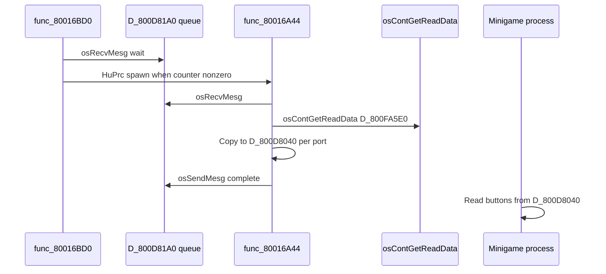

# MP2 Input and Save Engine

Hudson engine code that wraps libultra SI APIs — controller polling processes, EEPROM staging, checksum validation, and overlay UI.

## Module Map (Main Segment)

| Region | VRAM | Role |
|--------|------|------|
| Controller init | `0x80016840` | Detect pads, clear globals |
| Input poll start | `0x80017244` | Spawn input HuPrc |
| Read process | `0x80016A44` | Per-frame `osContGetReadData` |
| Input manager | `0x80016BD0` | Message-queue driven poll loop |
| Rumble request | `0x80016BBC` | Store port/strength bytes |
| EEPROM load core | `0x8001ACD0` | Probe, read, verify checksum |
| EEPROM pack write | `0x8001AEDC` | Struct → staging → long write |
| EEPROM pack read | `0x8001AFD8` | Long read → struct via `bcopy` |
| Checksum | `0x8001B114` | Byte-sum over `D_800D89F0` |
| Header block write | `0x8001B0B4` | Single `osEepromWrite` block 0 |

Async EEPROM UI operations spawn HuPrc children via **`func_8007EE0C`** @ `0x8007EE0C` (same helper used for other blocking I/O).

## Controller Initialization

**`func_80016840`** (`InitControllers` candidate):

1. Call **`func_800A2100`** (`osContInit` family) with **`D_800FA5E0`**
2. Zero **`D_800D8180`**, **`D_800D8184`**, **`D_800FD868`**
3. Walk **`OSContPad`** status bytes — count connected ports (type bit `0x8` in status nibble)
4. Store count in **`D_800FD868`**

**`func_80017244`** starts the background input system once (**`D_800D819C`** guard flag):

- Creates HuPrc @ **`func_80017228`** pointing at **`func_80016BD0`**
- Used from boot and after controller reconnect flows

## Per-Frame Input Flow



**`func_80016A44`** increments **`D_800D8180`** (total polls) and **`D_800D8184`** (slot index mod 8) — supports multiple concurrent input consumers without duplicate reads in one frame.

### Processed Input Buffer

**`D_800D8040`** — stride **24 bytes** × **4 players**:

- Derived from raw **`OSContPad`** via **`func_800A1FA8`** (dead-zone / clamp helper)
- Overlays read **`D_800FD868`** for human-controller count (rumble gating)

## CPU Players

**`PlayerIsCPU`** @ `0x8005DCA0` — **9 calls** in main segment.

Board setup stores CPU difficulty in **`GW_PLAYER.cpu_difficulty`**. Minigames branch:

```text
if (PlayerIsCPU(i)) { run_ai(i); }
else { read D_800D8040[i]; }
```

## EEPROM Staging Buffer

| Symbol | VRAM | Size |
|--------|------|------|
| `D_800D89F0` | `0x800D89F0` | 512 bytes — full EEPROM mirror |
| `D_800D89F8` | `0x800D89F8` | Secondary write buffer (504 B payload) |
| `D_800C9B60` | `0x800C9B60` | Expected header bytes (factory default) |
| `D_800C9B61` | `0x800C9B61` | “Save valid” flag |

### Load Sequence (`func_8001ACD0`)

1. **`osEepromProbe`** with retry
2. **`osEepromLongRead(mq, D_800D89F0, 0, 0x200)`**
3. If **`D_800C9B61`** set, compare bytes `0..7` against EEPROM vs reference
4. On mismatch: copy reference header into staging, zero tail, **`osEepromLongWrite`** repair
5. Return status in caller’s byte pointer

### Save Sequence (`func_8001AEDC` / `func_8001B078`)

1. Descriptor struct: `{ offset, src_ptr, length }` at stack + `0x8`
2. Copy game fields into **`D_800D89F0`** via loop in inner function
3. Compute aligned write size; **`osEepromLongWrite`**
4. Optional header refresh via **`func_8001B0B4`** → **`osEepromWrite`** block 0

**`func_8001AFD8`** read wrapper: **`osEepromLongRead`** then **`bcopy`** into caller struct using descriptor.

## Checksum Function

**`func_8001B114`** @ `0x8001B114`:

- Adds every byte in `[buf+8, buf+8+length)` into 16-bit sum
- Used to validate integrity before trusting loaded party data
- Not a cryptographic hash — sufficient for detecting corrupted SI transfers

Documented in engine as **`GetSaveFileChecksum`** candidate (not yet named in `symbol_addrs.txt`).

## Save / Load Overlay

UI flow lives in overlay catalog entry **SaveLoad** (`ovl_69`):

- Calls main-segment EEPROM packers through overlay trampolines
- PartyPlanner64 sym references **`ovl_69_SaveLoad`** helpers for board record display

Catalog: [../12-overlay-catalog.md](../12-overlay-catalog.md).

## Game State ↔ EEPROM

Fields that persist (partial RE — see [../05-game-state.md](../05-game-state.md)):

| Source struct | Typical saved content |
|---------------|----------------------|
| `GW_SYSTEM` | Board index, turn limits, minigame flags |
| `GW_PLAYER[4]` | Characters, coins/stars snapshot for records |
| Options | Sound, rumble prefs, unlock bits |

Runtime party state @ **`0x800F93A8`** (`GwSystem`) and **`0x800FD2C0`** (`gPlayers`) is **RAM-only during play** — written to EEPROM only on explicit save or auto-save hooks.

## Debugging Checklist

| Symptom | Check |
|---------|-------|
| No controller response | `func_80016840` detection; `D_800FD868` zero |
| Stuck on boot | EEPROM probe loop — missing 4K EEPROM |
| Save resets every boot | Checksum mismatch → repair write path |
| Rumble never fires | `osMotorInit` result; `func_80016BBC` params |
| CPU acts as human | `PlayerIsCPU` not set in `GW_PLAYER` |

## Cross-References

| Doc | Topic |
|-----|-------|
| [19-input-save-pipeline-overview.md](19-input-save-pipeline-overview.md) | Overview |
| [20-si-controller-hardware.md](20-si-controller-hardware.md) | SI / `OSContPad` |
| [21-eeprom-save-hardware.md](21-eeprom-save-hardware.md) | EEPROM protocol |
| [../10-input-and-save.md](../10-input-and-save.md) | Engine summary |
| [../05-game-state.md](../05-game-state.md) | `GW_SYSTEM` / `GW_PLAYER` |
| [input-save-call-inventory.md](input-save-call-inventory.md) | Call counts |
| [27-eeprom-save-byte-layout.md](27-eeprom-save-byte-layout.md) | Staging buffer byte map |
