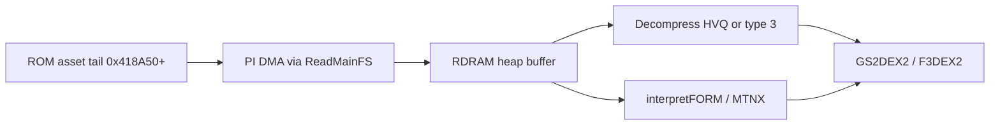

# Asset Pipeline Overview

How Mario Party 2 moves ~27 MB of ROM assets into RDRAM and onto the RCP — from the asset tail through MainFS, decompression, and display-list upload.

## End-to-End Flow

| Stage | CPU / HW | Output |
|-------|----------|--------|
| Lookup | `ReadMainFS` @ `0x80017680` | Pointer + size in perm/temp heap |
| Raw read | `func_80018990` / PI DMA | Bytes from cart |
| Decompress | `func_80027884` + type dispatch | Uncompressed tile or blob |
| Scene parse | `interpretFORM` / `interpretMTNX` | Model/texture handles |
| Draw | Display lists | RSP → RDP → framebuffer |

Engine summary: [../11-asset-formats.md](../11-asset-formats.md). Graphics path: [07-graphics-pipeline-overview.md](07-graphics-pipeline-overview.md).

## ROM Asset Region

| Range | Size | Content |
|-------|------|---------|
| `0x418A50`–`0x1FFFFFF` | ~27 MB | MainFS archives, audio banks, board packs, minigame blobs |

Main segment never maps the full asset region into RAM at once — files are **pulled on demand** through the filesystem layer.

## ReadMainFS Entry Point

**`ReadMainFS`** packs the file ID into **`$a0`**:

| Bits | Field |
|------|-------|
| Upper 16 | Filesystem / volume index (must be `< D_800D81C4`) |
| Lower 16 | File index within volume (must be `< D_800D81D0`) |

Flow @ `0x80017680`:

1. Split ID → validate against **`D_800D81C4`** / **`D_800D81D0`**
2. **`func_80017840`** (volume `0x2F`) or table walk via **`func_800175D4`**
3. **`func_80017748`**: lookup ROM offset + size → **`MallocPerm`** → **`func_80018990`** DMA copy

Returns allocated pointer or `NULL`.

## Decompression Dispatch

**`func_80018990`** @ `0x80018990` selects algorithm by compression type **`$a3`** (0–4):

| Type | Handler | Typical use |
|------|---------|-------------|
| 0 | `func_80017BC0` | Uncompressed / memcpy |
| 1 | `func_80017C5C` | Hudson type 1 |
| 2 | `func_80017ECC` | HVQ-style |
| 3 | `func_80018378` | Fast anim tiles (0x1800 B out) |
| 4 | `func_800187F4` | Extended HVQ variant |

High-level wrapper **`func_80018A30`**: `ReadMainFS` → **`func_80027884`** decompress → return size.

See [24-hvq-and-compression.md](24-hvq-and-compression.md).

## 3D and Board Assets

Structured containers use **FORM** (`"FORM"` magic) and chunk tags:

| Tag | ASCII | Parser |
|-----|-------|--------|
| `FORM` | File header | `interpretFORM` @ `0x8001D190` |
| `VTX1` | Vertex pool | inner `func_8001EA88` |
| `FAC1` | Face/index | inner `func_8001EA88` |
| `OBJ1` | Object graph | inner `func_8001EA88` |
| MTNX | Matrix/scene | `interpretMTNX` @ `0x80038F0C` |

See [25-mainfs-form-mtnx.md](25-mainfs-form-mtnx.md).

## Memory and Lifetime

| Allocation | API | Freed by |
|------------|-----|----------|
| Permanent asset | `MallocPerm` via ReadMainFS | `FreeMainFS` @ `0x80017800` |
| Overlay scratch | `MallocTemp` | Overlay teardown / temp reset |
| Decompress buffer | Often temp heap | Same overlay boundary |

**79** `ReadMainFS` calls in main; overlays add hundreds more — see [overlay-call-inventory.md](overlay-call-inventory.md).

## CPU vs RCP Cost

| Work | Dominant processor |
|------|-------------------|
| PI DMA from ROM | PI bus (CPU waits on mesg queue) |
| HVQ / type 3 decode | VR4300 (hot) |
| FORM/MTNX parse | VR4300 |
| GS2DEX2 board tiles | RSP + RDP |
| F3DEX2 characters | RSP + RDP |

Board scenes are often **CPU-bound during tile decode** and **RCP-bound during draw** — see [15-cpu-software-stack-overview.md](15-cpu-software-stack-overview.md).

## Related Docs

| Doc | Topic |
|-----|-------|
| [24-hvq-and-compression.md](24-hvq-and-compression.md) | Compression types |
| [25-mainfs-form-mtnx.md](25-mainfs-form-mtnx.md) | Filesystem and FORM |
| [17-memory-heaps-dma-coherency.md](17-memory-heaps-dma-coherency.md) | Heaps, PI DMA |
| [08-gbi-rsp-microcode.md](08-gbi-rsp-microcode.md) | Texture upload |
