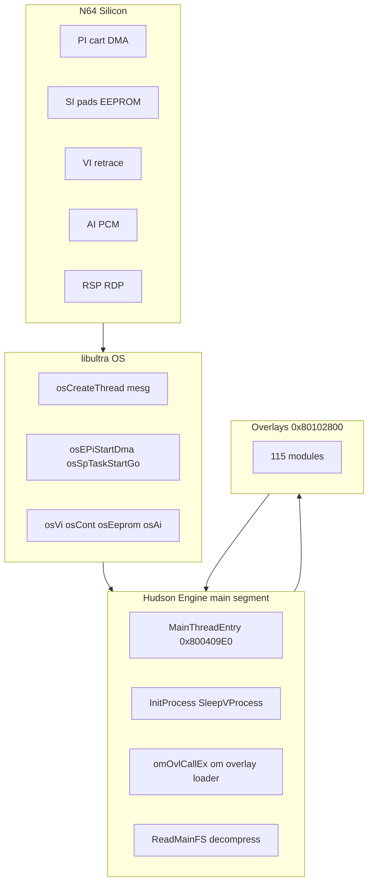

# Engine Integration Overview

How the Hudson Mario Party 2 engine binds to libultra and N64 hardware — the bridge between silicon docs **00–31** and engine docs **01–14**.

## Three-Layer Model



| Layer | Where | Role |
|-------|-------|------|
| Silicon | PI/SI/VI/AI/RCP | Physical buses |
| libultra | `0x8009C000`+ in main | OS threads, DMA managers, device drivers |
| Hudson engine | `0x80000460`+ | Game rules, HuPrc, overlay dispatch, asset glue |
| Overlays | `0x80102800` window | Board, minigame, menu code (PI-loaded) |

**Leo/64DD** symbols are linked but unused — [31-unused-libultra-leo-64dd.md](31-unused-libultra-leo-64dd.md).

## Integration Anchor Table

| Anchor | VRAM | libultra / HW | Integration doc |
|--------|------|---------------|-----------------|
| **`func_80000460`** | `0x80000460` | `osCreateThread` → idle | [33-boot-to-first-frame.md](33-boot-to-first-frame.md) |
| **`func_800004C0`** | `0x800004C0` | Spawns main thread @ `0x800409E0` | [33](33-boot-to-first-frame.md), [34](34-main-thread-frame-loop.md) |
| **`MainThreadEntry`** | **`0x800409E0`** | Init + frame loop | [34-main-thread-frame-loop.md](34-main-thread-frame-loop.md) |
| **`VideoInit`** | **`0x8007E2A0`** | `osViSetMode`, mesg queues | [33](33-boot-to-first-frame.md), [36](36-graphics-engine-integration.md) |
| **`GfxTaskThread`** | **`0x8007E754`** | `osSpTaskStartGo` | [36-graphics-engine-integration.md](36-graphics-engine-integration.md) |
| **`omOvlCallEx`** | **`0x800771EC`** | Schedules overlay load | [35-overlay-load-lifecycle.md](35-overlay-load-lifecycle.md) |
| **`omOvlGotoEx`** | **`0x800770EC`** | History push + call | [35](35-overlay-load-lifecycle.md) |
| **`omOvlReturnEx`** | **`0x80077160`** | History pop + restore | [35](35-overlay-load-lifecycle.md) |
| **`OverlayDmaLoad`** | **`0x8007C4E4`** | `osEPiStartDma`, cache inval | [35](35-overlay-load-lifecycle.md), [17](17-memory-heaps-dma-coherency.md) |
| **`ReadMainFS`** | **`0x80017680`** | PI DMA from asset ROM | [39-asset-to-gpu-bridge.md](39-asset-to-gpu-bridge.md) |
| **`PlaySound`** | **`0x80014B14`** | `alSndp*` → AI | [37-audio-engine-integration.md](37-audio-engine-integration.md) |
| **`func_80016BD0`** | `0x80016BD0` | `osContGetReadData` | [38-input-save-engine-integration.md](38-input-save-engine-integration.md) |
| **`func_8001ACD0`** | `0x8001ACD0` | `osEepromLongRead` | [38-input-save-engine-integration.md](38-input-save-engine-integration.md) |

## Master Binding Table (Engine → libultra → Hardware)

| Engine API | Primary libultra | Hardware bus | Hardware doc |
|------------|------------------|--------------|--------------|
| `MakePermHeap` / `MallocPerm` | — (heap in RDRAM) | CPU | [17](17-memory-heaps-dma-coherency.md) |
| `InitProcess` / `SleepVProcess` | — (cooperative) | CPU + VI timing | [18](18-mp2-cpu-engine-scheduling.md), [01](01-vr4300-cpu.md) |
| `omOvlCallEx` | `osEPiStartDma`, `osInvalICache` | PI | [03](03-boot-and-cartridge.md) |
| `func_80050A30` (DL build) | `MallocTemp`, `osWritebackDCache` | CPU → RSP | [36](36-graphics-engine-integration.md) |
| Gfx submit path | `osSpTaskLoad`, `osSpTaskStartGo` | RSP/RDP | [08](08-gbi-rsp-microcode.md) |
| VI swap path | `osViSwapBuffer` | VI | [10](10-vi-display-modes.md) |
| `PlaySound` | `alSndpPlay`, `alSynStartVoice` | AI (via aspMain) | [14](14-mp2-audio-engine-and-assets.md) |
| Input manager | `osContGetReadData` | SI | [20](20-si-controller-hardware.md) |
| EEPROM load | `osEepromLongRead/Write` | SI | [21](21-eeprom-save-hardware.md) |
| `ReadMainFS` | `osEPiStartDma` (via PI mgr) | PI | [23](23-asset-pipeline-overview.md) |

## Key Globals (Cross-Subsystem)

| Symbol | VRAM | Subsystem |
|--------|------|-----------|
| `overlay_table` | `0x800CAD90` | Overlay ROM/VRAM descriptors |
| `D_800FA63C` | `0x800FA63C` | Current overlay ID |
| `D_800F9298` | `0x800F9298` | Main engine mesg queue |
| `D_800F92B8` | `0x800F92B8` | Overlay/VI event queue |
| `D_800FDBE8` | `0x800FDBE8` | Overlay history stack entries |
| `D_800FA5E0` | `0x800FA5E0` | `OSContPad[4]` |
| `D_800D8040` | `0x800D8040` | Processed button ring |
| `D_800EB910` | `0x800EB910` | Framebuffer pointer |
| `D_800ECAD0` | `0x800ECAD0` | Active RSP task |
| `permHeapPtr` | `0x800DEFD0` | Permanent allocator |
| `tempHeapPtr` | `0x800DEFD4` | Temp allocator (overlay boundary) |
| `GwSystem` | `0x800F93A8` | Active game state |

## Integration Atlas Index

| Doc | Topic |
|-----|-------|
| [33-boot-to-first-frame.md](33-boot-to-first-frame.md) | Entry → heaps → VI → first overlay |
| [34-main-thread-frame-loop.md](34-main-thread-frame-loop.md) | Per-frame mesg dispatch |
| [35-overlay-load-lifecycle.md](35-overlay-load-lifecycle.md) | om + PI DMA + `0x80102800` |
| [36-graphics-engine-integration.md](36-graphics-engine-integration.md) | DL → RSP → RDP → VI |
| [37-audio-engine-integration.md](37-audio-engine-integration.md) | PlaySound → AI |
| [38-input-save-engine-integration.md](38-input-save-engine-integration.md) | SI poll → EEPROM |
| [39-asset-to-gpu-bridge.md](39-asset-to-gpu-bridge.md) | MainFS → GPU |
| [engine-integration-map.md](engine-integration-map.md) | Auto-generated call edges |

## Tooling

```bash
python3 tools/engine_integration_map.py   # regenerate integration map
python3 tools/overlay_xref.py             # overlay API usage
python3 tools/hardware_xref.py            # main-segment libultra counts
```

## Related Docs

- [15-cpu-software-stack-overview.md](15-cpu-software-stack-overview.md) — CPU vs RCP division
- [18-mp2-cpu-engine-scheduling.md](18-mp2-cpu-engine-scheduling.md) — HuPrc + om summary
- [../02-boot-and-init.md](../02-boot-and-init.md) — Engine boot index
- [../14-decomp-progress.md](../14-decomp-progress.md) — C match status (integration atlas uses asm)
