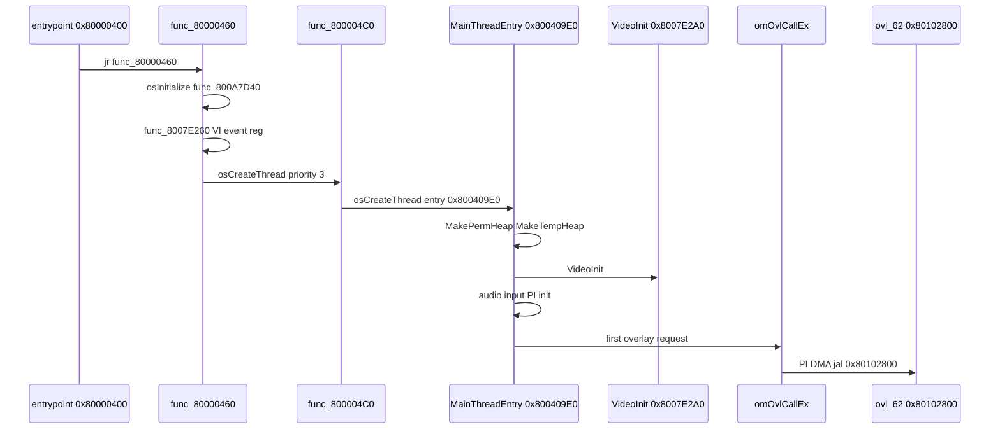

# Boot to First Frame

Ordered trace from cartridge entry through engine init to the first overlay load.

## Boot Chain



## Stage 1: Entrypoint

[`asm/entrypoint.s`](../../asm/entrypoint.s) @ **`0x80000400`**:

1. Clear BSS `0x800D4BF0`–`0x800D4BF0+0x2DC10`
2. Set `$sp` → `D_800FC730`
3. Jump to **`func_80000460`** @ `0x80000460`

Hardware: [03-boot-and-cartridge.md](03-boot-and-cartridge.md), [02-memory-map.md](02-memory-map.md).

## Stage 2: Early libultra (`func_80000460`)

| Step | Call | VRAM | Doc |
|------|------|------|-----|
| OS init | `func_800A7D40` | `0x800A7D40` | [16-libultra-os-threads-messaging.md](16-libultra-os-threads-messaging.md) |
| VI hook | `func_8007E260` | `0x8007E260` | [10-vi-display-modes.md](10-vi-display-modes.md) |
| Idle thread | `osCreateThread` @ `D_800D53F0`, entry **`func_800004C0`** | — | [16](16-libultra-os-threads-messaging.md) |

## Stage 3: Main Thread Spawn (`func_800004C0`)

@ **`0x800004C0`**:

```text
osCreateThread(D_800D55A0, priority=3, entry=0x800409E0, stack=D_800FC730)
osStartThread(D_800D55A0)
osSetIntMask(0x3FFF01)
osSetThreadPri(0)   // idle forever at .L8000051C
```

The **game engine** runs on thread **`D_800D55A0`**, not the idle thread.

## Stage 4: Engine Init (`MainThreadEntry` @ `0x800409E0`)

Init block in [`asm/1060.s`](../../asm/1060.s) @ `0x800409E0`:

| Order | Call | Purpose | HW doc |
|-------|------|---------|--------|
| 1 | `MakePermHeap(0x80140000, 0x1A0000)` | 1.625 MB perm arena | [17](17-memory-heaps-dma-coherency.md) |
| 2 | `MakeTempHeap(0x80128000, 0x18000)` | 96 KB temp arena | [17](17-memory-heaps-dma-coherency.md) |
| 3 | **`VideoInit(0x1E, 1)`** | VI mode, RCP queues | [36](36-graphics-engine-integration.md) |
| 4 | `func_80040CF8(3)` | Process table init (3 slots) | [18](18-mp2-cpu-engine-scheduling.md) |
| 5 | `func_8001CB00` | Audio graph setup | [37](37-audio-engine-integration.md) |
| 6 | `func_8007BDA0` | RSP ucode load bootstrap | [08](08-gbi-rsp-microcode.md) |
| 7 | `func_8007EA50` | Gfx thread spawn helper | [36](36-graphics-engine-integration.md) |
| 8 | `func_800169AC(4, 1)` | Audio driver init | [37](37-audio-engine-integration.md) |
| 9 | `func_80088350` | Sound bank tables | [14](14-mp2-audio-engine-and-assets.md) |
| 10 | `func_800172F0` | Input subsystem init | [38](38-input-save-engine-integration.md) |
| 11 | `func_8007C370` | **`osCreatePiManager`** | [03](03-boot-and-cartridge.md) |
| 12 | `func_80017530(D_0041DD30)` | MainFS mount / asset table | [39](39-asset-to-gpu-bridge.md) |
| 13 | `func_8007D4F0` | Additional PI setup | [17](17-memory-heaps-dma-coherency.md) |
| 14 | `osCreateMesgQueue` ×2 | `D_800F9298`, `D_800F92B8` | [16](16-libultra-os-threads-messaging.md) |
| 15 | `func_80016F54` | Input manager HuPrc | [38](38-input-save-engine-integration.md) |
| 16 | `osViSetSpecialFeatures(2)` | Gamma / dither | [10](10-vi-display-modes.md) |
| 17 | `func_8001D184(2)` | FORM parser init | [39](39-asset-to-gpu-bridge.md) |
| 18 | `func_8007D5D4` | Spawn **`GfxTaskThread`** @ `0x8007E754` | [36](36-graphics-engine-integration.md) |

After init, engine enters the **frame loop** ([34-main-thread-frame-loop.md](34-main-thread-frame-loop.md)). First overlay load is triggered by mesg type **`1`** on queue **`D_800F9298`**, not inline in init.

## Stage 5: First Overlay (Title `ovl_62`)

Overlay dispatch path:

1. Mesg **`1`** → `func_8007C184` (save RSP state) → `func_8007C058` (alloc overlay slot)
2. `func_8007DAA0(1)` — schedule load for overlay ID in **`D_800FA63C`**
3. **`omOvlCallEx`** @ `0x800771EC` sets `D_800FA63C`, event/stat in `D_800CD414`/`416`
4. **`func_800775D8`** → **`OverlayDmaLoad`** @ `0x8007C4E4` → PI DMA to **`0x80102800`**
5. **`jal func_80102800`** @ `0x80077C98` — overlay entry

Title overlay ID **`0x62`** is recognized in overlay loader (`xori $s1, 0x62` @ `0x800774F0`). Debug build uses **`ovl_00`** instead.

Typical title → menu: `omOvlGotoEx(0x63, …)` from overlay code — see [`src/overlays/ovl_63_MainMenu/3E4250.c`](../../src/overlays/ovl_63_MainMenu/3E4250.c).

## Open RE Items

| Item | Status |
|------|--------|
| Exact MainFS mount vs first overlay timing | Mount @ `func_80017530` before frame loop; assets loaded on demand |
| Full `__osInitialize` tree | Wrapped in `func_800A7D40` |
| `InitObjSys` / `InitProcess` in init block | Called from overlay entry, not main init |

## Related Docs

- [32-engine-integration-overview.md](32-engine-integration-overview.md) — Hub
- [34-main-thread-frame-loop.md](34-main-thread-frame-loop.md) — Post-init loop
- [35-overlay-load-lifecycle.md](35-overlay-load-lifecycle.md) — om API detail
- [../02-boot-and-init.md](../02-boot-and-init.md) — Engine boot summary
