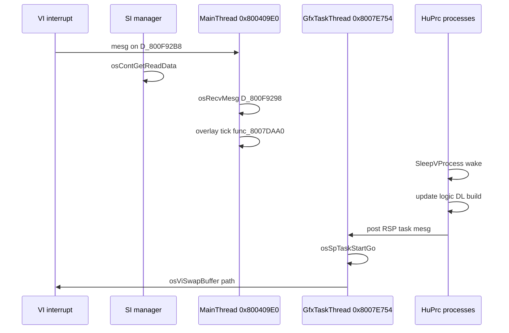

# Main Thread Frame Loop

How **`MainThreadEntry`** @ **`0x800409E0`** drives one NTSC frame — mesg queues, overlay dispatch, and subsystem ticks.

## Thread Context

| Property | Value |
|----------|-------|
| Thread struct | `D_800D55A0` @ `0x800D55A0` |
| Entry | **`0x800409E0`** |
| Stack | `D_800FC730` |
| Priority | 3 |
| Runs on | VR4300 (same CPU as libultra managers) |

HuPrc processes are **not** OS threads — they run inside this thread's stack during scheduler ticks. See [01-vr4300-cpu.md](01-vr4300-cpu.md), [18-mp2-cpu-engine-scheduling.md](18-mp2-cpu-engine-scheduling.md).

## Frame Loop Structure

After init (@ `0x80040B80`), the engine loops forever:

```text
.L80040B80:
    osRecvMesg(D_800F92B8, &msg, BLOCK)     // overlay/VI queue
    if (failed) goto shutdown
    osRecvMesg(D_800F9298, &msg, BLOCK)     // main engine queue
    switch (msg):
      case 1:  overlay_load_tick()          // PI DMA + jal 0x80102800 path
      case 2:  shutdown_flag = 1
      case 0x309: frame_counter++
      default:  continue
```

## Mesg Queues

| Queue | VRAM | Producers | Consumers |
|-------|------|-----------|-----------|
| **`D_800F92B8`** | `0x800F92B8` | VI manager, overlay events | Main thread (blocking recv) |
| **`D_800F9298`** | `0x800F9298` | Gfx thread, overlay loader | Main thread |

Created during init @ `0x80040B00`–`0x80040B44`.

## Mesg Type 1 — Overlay / Gfx Tick

When **`D_800F9298`** delivers mesg **`1`**:

| Step | Function | VRAM | Role |
|------|----------|------|------|
| 1 | `func_8007C184` | `0x8007C184` | Save RSP PC/state to `D_800E2228` |
| 2 | `func_8007C058(0xC8, 0, 0)` | `0x8007C058` | Allocate overlay transition slot |
| 3 | Frame skip guard | — | Compare `D_800FDC6C` vs local counter |
| 4 | `func_80016F54` | `0x80016F54` | Refresh input manager (if process count ok) |
| 5 | `func_8001736C` | `0x8001736C` | Input post-process |
| 6 | **`func_8007DAA0(1)`** | `0x8007DAA0` | Overlay loader state machine step |
| 7 | `func_8007C094` | `0x8007C094` | Restore RSP state from slot |
| 8 | `func_8007C1D0` | `0x8007C1D0` | Copy saved state back to HW |

If overlay ID changed (`D_800C9E60` compare), increment process counter @ `D_800CB0A0`.

This path is where **`jal func_80102800`** eventually runs (inside `func_8007DAA0` chain → `func_800775D8`).

## Mesg Type 0x309 — Frame Counter

Increments **`D_800FD848`** — global frame counter used by timing/debug.

## Parallel: Gfx Task Thread

**`GfxTaskThread`** @ **`0x8007E754`** runs concurrently (OS thread):

```text
loop:
    osRecvMesg(gfx_queue, ...)
    osWritebackDCacheAll()
    osSpTaskStartGo(task)    // RSP microcode
```

Main thread **builds** display lists; gfx thread **submits** RSP tasks. See [36-graphics-engine-integration.md](36-graphics-engine-integration.md).

## HuPrc Within a Frame

Overlays and main segment spawn HuPrc processes via **`InitProcess`**. Each overlay loop typically:

```text
while (running) {
    game_logic();
    SleepVProcess();   // yield until next VI retrace
}
```

**`SleepVProcess`** @ `0x8007DA44` → **`SleepProcess(0)`** — syncs to retrace counter **`D_800EB890`**.

Inventory: **164** main + **2092** overlay `SleepVProcess` calls ([overlay-call-inventory.md](overlay-call-inventory.md)).

## Retrace Globals

| Symbol | VRAM | Role |
|--------|------|------|
| `D_800EB890` | `0x800EB890` | Retrace counter (HuPrc sleep) |
| `D_800EB918` | `0x800EB918` | VI event mesg queue ptr |
| `D_800FDC6C` | `0x800FDC6C` | Display swap generation |
| `D_800F92B2` | `0x800F92B2` | Engine phase byte (boot/menu/board) |

## CPU vs OS Thread Timeline (One Frame)



## Related Docs

- [33-boot-to-first-frame.md](33-boot-to-first-frame.md) — Init before loop
- [35-overlay-load-lifecycle.md](35-overlay-load-lifecycle.md) — om loader detail
- [../03-process-system.md](../03-process-system.md) — HuPrc API
- [15-cpu-software-stack-overview.md](15-cpu-software-stack-overview.md) — Layer diagram
