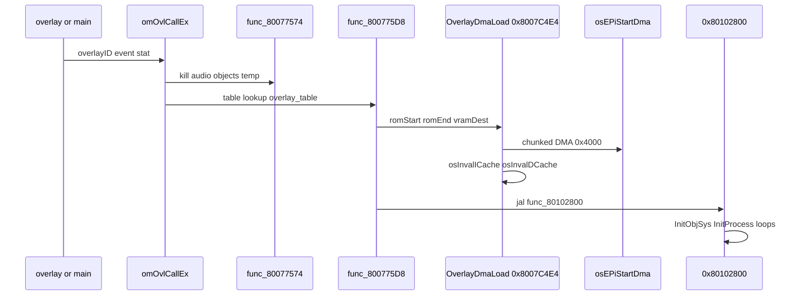

# Overlay Load Lifecycle

End-to-end overlay swap — `omOvlCallEx`, PI DMA, cache invalidate, and `0x80102800` entry.

## API Surface

Declared in [`include/functions.h`](../../include/functions.h), stubbed in [`src/engine/om.c`](../../src/engine/om.c):

| API | VRAM | Role |
|-----|------|------|
| **`omOvlGotoEx`** | **`0x800770EC`** | Push history, call `omOvlCallEx` |
| **`omOvlCallEx`** | **`0x800771EC`** | Set overlay ID/event/stat; schedule load |
| **`omOvlReturnEx`** | **`0x80077160`** | Pop history, restore previous overlay |
| `func_80077538` | `0x80077538` | Patch history entry in place |

## omOvlCallEx Internals

@ **`0x800771EC`** — key globals written:

| Global | VRAM | Field |
|--------|------|-------|
| `D_800FA63C` | `0x800FA63C` | Overlay ID (`$a0`) |
| `D_800CD414` | `0x800CD414` | Event (`$a1`) |
| `D_800CD416` | `0x800CD416` | Stat flags (`$a2`) |
| `D_800CD41C` | `0x800CD41C` | Load pending flag |

Stat flags (`$a2`):

| Bit | Effect |
|-----|--------|
| `0x01` | Special heap mode (checks `D_800FFDF2` / `D_800F9562` / `D_80102702`) |
| `0x02` | Alt heap mode |
| `0x04` | Third heap layout |
| `0x40` | Phase gate vs `D_800F92B2` |
| `0x80` | Phase gate vs `D_800F92B2` |

Board overlays (`0x5F`–`0x73`) get special handling — saves prior ID @ `D_800CD408`.

## Load Sequence



### 1. Teardown (`func_80077574` @ `0x80077574`)

Before new overlay:

- Set load state `D_800CD412 = 4`
- Save turn counter → `D_800E2130`
- **`func_8002864C`** — audio stop
- **`func_8002F1A4`** — sound cleanup
- **`func_80076390`** — object kill
- **`func_8001A4C0`** — temp heap reset path
- **`func_80023124`** — additional cleanup
- **`func_80029708(1)`** — fade/transition prep

### 2. Table Lookup

**`overlay_table`** @ **`0x800CAD90`** — 36-byte rows (from [`tools/scan_overlays.py`](../../tools/scan_overlays.py)):

| Offset | Field |
|--------|-------|
| +0 | ROM start |
| +4 | ROM end |
| +8 | Text VRAM (`0x80102800`) |
| +12 | Data VRAM |
| +16 | BSS VRAM |
| +20 | Entry (`func_80102800`) |

### 3. PI DMA (`OverlayDmaLoad` @ `0x8007C4E4`)

```text
osInvalICache(dest, size_aligned)
osInvalDCache(dest, size_aligned)
loop size in 0x4000 chunks:
    osEPiStartDma via func_8007C3C8
    osRecvMesg(PI queue D_800E2850, BLOCK)
```

Hardware: [03-boot-and-cartridge.md](03-boot-and-cartridge.md), [17-memory-heaps-dma-coherency.md](17-memory-heaps-dma-coherency.md).

### 4. Overlay Entry

**`jal func_80102800`** @ `0x80077C98` — all 115 overlays share this VRAM entry.

Typical overlay init ([`ovl_63_MainMenu/3E4250.c`](../../src/overlays/ovl_63_MainMenu/3E4250.c)):

```c
InitObjSys(10, 0);
omOvlCallEx(0x63, 1, 0x192);
omOvlGotoEx(0, 0x63, 1, 0x192);
InitProcess(...);
```

## History Stack

**`omOvlGotoEx`** pushes up to **12** entries @ **`D_800FDBE8`**:

| Field | Size |
|-------|------|
| overlay ID | 4 B @ +0 |
| event | 2 B @ +4 |
| stat | 2 B @ +6 |

Index: **`D_800CD418`**. **`omOvlReturnEx`** pops and re-invokes **`omOvlCallEx`**.

## Phase Table (Typical Flow)

| Phase | Overlay ID | Name |
|-------|------------|------|
| Title | `0x62` | TitleScreenAndIntro |
| Main menu | `0x63` | MainMenu |
| Game setup | `0x64` | GameSetup |
| Board select | `0x5E` | BoardSelect |
| Board play | `0x5F` | BoardMain |
| Board events | `0x60` | BoardEvents |
| Minigame | `0x00`–`0x5D` | Per-minigame |
| Results | `0x70` | Results |

Full catalog: [../12-overlay-catalog.md](../12-overlay-catalog.md).

## Overlay API Usage (Inventory)

Top **`ReadMainFS`** consumers: `ovl_5F_BoardMain` (77), `ovl_60_BoardEvents` (57). Top **`RunDecisionTree`**: board overlays (90 calls total in overlays).

See [overlay-call-inventory.md](overlay-call-inventory.md).

## Related Docs

- [34-main-thread-frame-loop.md](34-main-thread-frame-loop.md) — When loader tick runs
- [../04-object-manager.md](../04-object-manager.md) — Engine om guide
- [../07-minigame-framework.md](../07-minigame-framework.md) — Overlay lifecycle
- [32-engine-integration-overview.md](32-engine-integration-overview.md) — Anchor table
