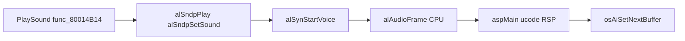

# Audio Engine Integration

How **`PlaySound`**, music, and sample banks reach the AI DAC through libaudio and aspMain.

## Stack



Hardware: [11-audio-pipeline-overview.md](11-audio-pipeline-overview.md)–[14-mp2-audio-engine-and-assets.md](14-mp2-audio-engine-and-assets.md).

## Init Path (Boot)

From **`MainThreadEntry`** @ `0x800409E0`:

| Order | Function | Role |
|-------|----------|------|
| 1 | `func_8001CB00` | Create AL heap, synth, drivers |
| 2 | `func_800169AC(4, 1)` | Audio manager thread / AI setup |
| 3 | `func_80088350` | Bank pointer tables |
| 4 | `func_800172F0` | Link to SI/input timing |

aspMain microcode ROM @ **`0xBF560`**. AI buffers in RDRAM — [12-ai-hardware-and-aspMain.md](12-ai-hardware-and-aspMain.md).

## PlaySound Path

**`PlaySound`** @ **`0x80014B14`**:

```text
PlaySound(index):
  → func_80014B30(index)
  → alSndpSetSound / alSndpAllocate
  → alSndpPlay
  → (per frame) alSynStartVoice via alAudioFrame
  → RSP aspMain mix
  → osAiSetNextBuffer → AI DMA → DAC
```

| Global | VRAM | Role |
|--------|------|------|
| `D_800D58E4` | `0x800D58E4` | Active sound bank ptr |
| Sound table | main `.data` | Index → asset ID |

**`PlayCharacterSound`** @ `0x8007975C` — voice lines with overlap guard (12 overlay calls).

## Sample Bank DMA

**`func_8000EB3C`** @ `0x8000EB3C` — PI DMA audio samples from ROM:

```text
osEPiStartDma(cartHandle, romOffset, rdramBuffer, size)
osInvalDCache(buffer)
osRecvMesg(PI completion)
```

Same PI path as overlays — [03-boot-and-cartridge.md](03-boot-and-cartridge.md).

## Music (Sequences)

**`func_8000F744`** @ `0x8000F744`:

```text
ReadMainFS(seq_file_id) → bank in RDRAM
alSeqpSetSeq / alSeqpSetBank
alSeqpPlay
```

Assets in ROM tail — [14-mp2-audio-engine-and-assets.md](14-mp2-audio-engine-and-assets.md), [39-asset-to-gpu-bridge.md](39-asset-to-gpu-bridge.md).

## Per-Frame Audio

**`alAudioFrame`** runs from the audio/libultra thread (not HuPrc). It:

1. Pulls notes from active voices
2. Builds acmd list for RSP
3. Submits aspMain task
4. Refills AI double-buffer via **`osAiSetNextBuffer`**

Frequency set via **`osAiSetFrequency`** during init.

## Overlay Teardown

**`func_80077574`** (overlay unload) calls:

- **`func_8002864C`** — stop all sounds
- **`func_8002F1A4`** — release voices

Prevents audio bleed across minigame ↔ board transitions.

## Inventory

| API | Main `jal` | Overlay total |
|-----|------------|---------------|
| `PlaySound` | low | via engine wrappers |
| `PlayCharacterSound` | 3 | 12 |
| `alSeqpPlay` | see [audio-call-inventory.md](audio-call-inventory.md) | — |

## Related Docs

- [../09-audio.md](../09-audio.md) — Engine audio index
- [33-boot-to-first-frame.md](33-boot-to-first-frame.md) — Audio init order
- [35-overlay-load-lifecycle.md](35-overlay-load-lifecycle.md) — Teardown on swap
