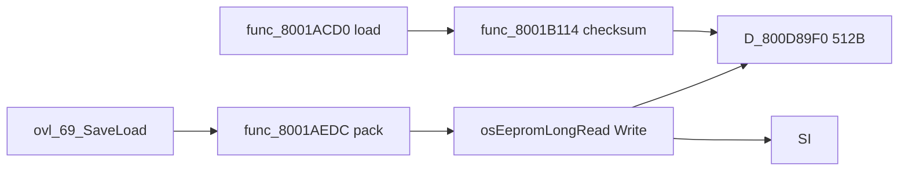

# Input and Save Engine Integration

SI controller polling and EEPROM I/O as wired through Hudson engine wrappers.

## Input Stack


Hardware: [19-input-save-pipeline-overview.md](19-input-save-pipeline-overview.md)–[22-mp2-input-save-engine.md](22-mp2-input-save-engine.md).

## Boot Init

From **`MainThreadEntry`**:

| Call | VRAM | Role |
|------|------|------|
| **`func_800172F0`** | `0x800172F0` | Controller probe, `osContInit` path |
| **`func_80016F54`** | `0x80016F54` | Spawn input manager HuPrc |

## SI Manager (libultra)

Background OS thread (not HuPrc):

```text
osContStartReadData()
  ... PIF Joybus transaction ...
osContGetReadData(D_800FA5E0)   // OSContPad[4] @ 0x800FA5E0
osSendMesg(input_queue)
```

| libultra | VRAM | Doc |
|----------|------|-----|
| `osContStartReadData` | `0x800A1FBC` | [20](20-si-controller-hardware.md) |
| `osContGetReadData` | `0x800A1F20` | [20](20-si-controller-hardware.md) |

## Engine Input Manager

**`func_80016BD0`** @ **`0x80016BD0`** — HuPrc or callback that:

1. Blocks on mesg queue **`D_800D81A0`**
2. Reads **`D_800FA5E0`** (`OSContPad[4]`)
3. Applies dead-zone / edge detect
4. Writes 8-frame ring **`D_800D8040`**

Overlays read processed buttons via engine helpers — not raw `OSContPad` in hot paths.

## Rumble

**`func_80016BBC`** @ `0x80016BBC` → **`osMotorAccess`** @ `0x800A7668`.

Detection: **`osMotorInit`** during `func_800172F0`.

## CPU Players

**`PlayerIsCPU`** @ `0x8005DCA0` — skips hardware read for AI seats (31 overlay + 9 main calls).

## “Press A” Data Path (Board)

```text
VI retrace → SI thread completes poll
  → osContGetReadData → D_800FA5E0
  → func_80016BD0 copies to D_800D8040
  → board overlay HuPrc wakes from SleepVProcess
  → reads button ring → menu / movement logic
```

Latency: **1 frame** typical (poll aligned to retrace via HuPrc).

## EEPROM Save Stack



### Load (`func_8001ACD0` @ `0x8001ACD0`)

1. **`osEepromProbe`** — detect 4K EEPROM
2. **`osEepromLongRead(0, D_800D89F0, 0x200)`** — 512 bytes
3. Header compare vs **`D_800C9B60`** (8 B template)
4. **`func_8001B114`** — checksum verify
5. Copy fields into **`GwSystem`** / options globals

Byte layout: [27-eeprom-save-byte-layout.md](27-eeprom-save-byte-layout.md).

### Save (write path)

1. Pack RAM state → **`D_800D89F0`**
2. **`func_8001B114`** — compute checksum
3. **`osEepromLongWrite`** payload @ +8 (0x1F8 bytes)
4. **`osEepromLongWrite`** header (8 bytes)

Hardware protocol: [21-eeprom-save-hardware.md](21-eeprom-save-hardware.md).

## Related Globals

| Symbol | VRAM | Role |
|--------|------|------|
| `D_800FA5E0` | `0x800FA5E0` | Raw `OSContPad[4]` |
| `D_800D8040` | `0x800D8040` | Engine button ring |
| `D_800D89F0` | `0x800D89F0` | EEPROM staging |
| `GwSystem` | `0x800F93A8` | Runtime party state |

## Related Docs

- [../10-input-and-save.md](../10-input-and-save.md) — Engine summary
- [38 from input-save-call-inventory](input-save-call-inventory.md) — Call counts
- [34-main-thread-frame-loop.md](34-main-thread-frame-loop.md) — Input refresh in mesg type 1
